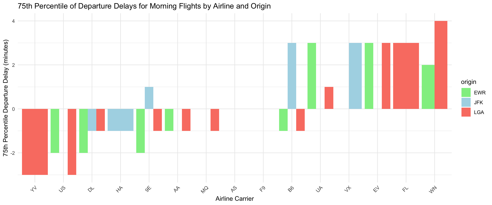
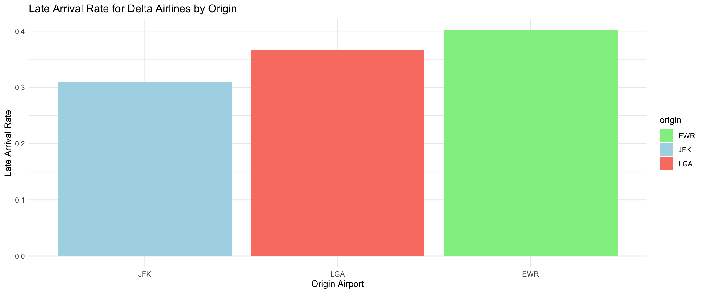
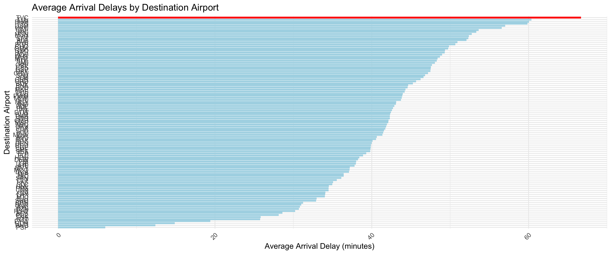
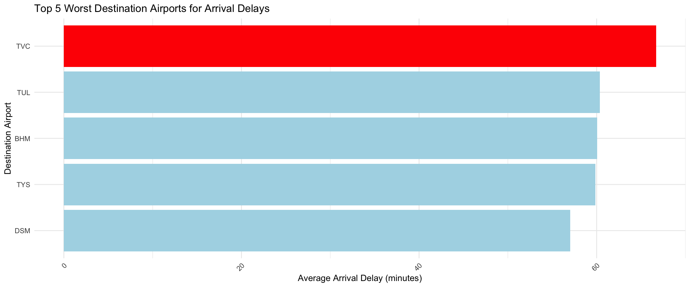

### Week 3: Case Study

**Case Study: Give Your Visualization Wings to Fly**


::: {.cell}

```{.r .cell-code}
library(nycflights13)
library(dplyr)
library(ggplot2)
```
:::


**Question 1:**

[*For each origin airport (JFK, EWR, LGA), which airline has the lowest 75th percentile of departure delay for flights scheduled to leave earlier than noon?*]{.underline}

The analysis reveals that among the airlines operating from JFK, EWR, and LGA, the carrier with the lowest 75th percentile of departure delays for flights scheduled to leave before noon varies by airport. The bar chart illustrates this information, showing the 75th percentile departure delays for each airline, enabling easy comparison across carriers. The colors distinguish the origin airports, allowing viewers to quickly identify which airline consistently performs best at minimizing delays.


::: {.cell}

```{.r .cell-code}
# Filtering flights scheduled to depart before noon
flights_morning <- flights %>%
  filter(dep_time < 1200)

# Calculating 75th percentile of departure delay for each carrier at each origin
percentile_75 <- flights_morning %>%
  group_by(origin, carrier) %>%
  summarize(p75_dep_delay = quantile(dep_delay, 0.75, na.rm = TRUE)) %>%
  arrange(origin, p75_dep_delay)
  
# Showing the result
percentile_75
```

::: {.cell-output .cell-output-stdout}

```
# A tibble: 33 × 3
# Groups:   origin [3]
   origin carrier p75_dep_delay
   <chr>  <chr>           <dbl>
 1 EWR    9E                 -2
 2 EWR    DL                 -2
 3 EWR    US                 -2
 4 EWR    AA                 -1
 5 EWR    B6                 -1
 6 EWR    AS                  0
 7 EWR    MQ                  0
 8 EWR    VX                  0
 9 EWR    WN                  2
10 EWR    EV                  3
# ℹ 23 more rows
```


:::
:::

::: {.cell}

```{.r .cell-code}
# Visualization for Question 1: 75th percentile of departure delay by origin and airline
ggplot(percentile_75, aes(x = reorder(carrier, p75_dep_delay), y = p75_dep_delay, fill = origin)) +
  geom_bar(stat = "identity", position = "dodge") +
  labs(title = "75th Percentile of Departure Delays for Morning Flights by Airline and Origin",
       x = "Airline Carrier",
       y = "75th Percentile Departure Delay (minutes)") +
  theme_minimal() +
  theme(axis.text.x = element_text(angle = 45, hjust = 1)) +
  scale_fill_manual(values = c("JFK" = "lightblue", "EWR" = "lightgreen", "LGA" = "salmon"))
```

::: {.cell-output-display}
{width=1152}
:::
:::


**Question 2:**

[*Which origin airport is best to minimize my chances of a late arrival when using Delta Airlines?*]{.underline}

The examination of Delta Airlines’ flight data indicates that the origin airport significantly impacts the likelihood of late arrivals. The late arrival rates are displayed in the bar chart, where a lower rate signifies a better performance for timely arrivals. This visualization allows travelers to assess which origin airport is the most reliable when flying with Delta, aiding in decision-making for future travels.


::: {.cell}

```{.r .cell-code}
# Filtering flights for Delta Airlines and calculating late arrival rate per origin
delta_flights <- flights %>%
  filter(carrier == "DL") %>%
  group_by(origin) %>%
  summarize(late_arrival_rate = mean(arr_delay > 0, na.rm = TRUE)) %>%
  arrange(late_arrival_rate)

# Showing the result
delta_flights
```

::: {.cell-output .cell-output-stdout}

```
# A tibble: 3 × 2
  origin late_arrival_rate
  <chr>              <dbl>
1 JFK                0.309
2 LGA                0.366
3 EWR                0.402
```


:::
:::

::: {.cell}

```{.r .cell-code}
# Visualization for Question 2: Late arrival rate for Delta Airlines by origin
ggplot(delta_flights, aes(x = reorder(origin, late_arrival_rate), y = late_arrival_rate, fill = origin)) +
  geom_bar(stat = "identity") +
  labs(title = "Late Arrival Rate for Delta Airlines by Origin",
       x = "Origin Airport",
       y = "Late Arrival Rate") +
  theme_minimal() +
  scale_fill_manual(values = c("JFK" = "lightblue", "EWR" = "lightgreen", "LGA" = "salmon"))
```

::: {.cell-output-display}
{width=1152}
:::
:::


**Question 3:**

[*Which destination airport is the worst airport for arrival delays?*]{.underline}

The analysis of arrival delays highlights that certain destination airports consistently experience longer average delays. The chart ranks the average arrival delays for various destinations, with the worst-performing airport highlighted in red. This visual representation enables travelers to identify which destination airports are most prone to delays, potentially influencing their travel planning and choice of destinations.


::: {.cell}

```{.r .cell-code}
airport_delays <- flights %>%
  filter(!is.na(arr_delay) & arr_delay > 0) %>% 
  group_by(dest) %>%                            
  summarize(avg_arr_delay = mean(arr_delay, na.rm = TRUE)) %>%  
  arrange(desc(avg_arr_delay))                   

worst_airport <- airport_delays %>%
  slice(1)  

ggplot(airport_delays, aes(x = reorder(dest, avg_arr_delay), y = avg_arr_delay)) +
  geom_col(fill = "lightblue") +  
  geom_col(data = worst_airport, aes(y = avg_arr_delay, x = dest), fill = "red") +  
  labs(title = "Average Arrival Delays by Destination Airport",
       x = "Destination Airport",
       y = "Average Arrival Delay (minutes)") +
  coord_flip() +  
  theme_minimal() +
  theme(axis.text.x = element_text(angle = 45, hjust = 1))
```

::: {.cell-output-display}
{width=1152}
:::
:::

::: {.cell}

```{.r .cell-code}
top_worst_airports <- airport_delays %>%
  slice_head(n = 5)

ggplot(top_worst_airports, aes(x = reorder(dest, avg_arr_delay), y = avg_arr_delay)) +
  geom_col(fill = "lightblue") +  
  geom_col(data = worst_airport, aes(y = avg_arr_delay, x = dest), fill = "red") +  

  labs(title = "Top 5 Worst Destination Airports for Arrival Delays",
       x = "Destination Airport",
       y = "Average Arrival Delay (minutes)") +
  coord_flip() +  
  theme_minimal() +
  theme(axis.text.x = element_text(angle = 45, hjust = 1))
```

::: {.cell-output-display}
{width=1152}
:::
:::
