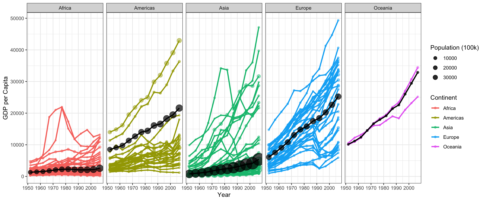

### Week 3: Task 1

**Gapminder Part 2**


::: {.cell}

```{.r .cell-code}
library(gapminder)
library(tidyverse)
library(dplyr)
library(ggplot2)
```
:::

::: {.cell}

```{.r .cell-code}
data <- gapminder %>%
  filter(country != "Kuwait")
```
:::

::: {.cell}

```{.r .cell-code}
average_gdp <- data %>%
  group_by(year, continent) %>%
  summarise(
    average_gdp = weighted.mean(gdpPercap, pop, na.rm = TRUE),
    total_pop = sum(pop, na.rm = TRUE),  
  )
```
:::

::: {.cell}

```{.r .cell-code}
ggplot(data, aes(x = year, y = gdpPercap, color = continent)) +
  
  geom_point(aes(size = pop), alpha = 0.5) +  
  geom_line(aes(group = country), size = 1) +  
  
  geom_line(data = average_gdp, aes(x = year, y = average_gdp), color = "black", size = 1) +  
  geom_point(data = average_gdp, aes(x = year, y = average_gdp, size = total_pop), color = "black", alpha = 0.7) +  
  
  theme_bw() +  
  scale_size_continuous(
    range = c(1, 10),  
    name = "Population (100k)", 
    #breaks = c(100,000,000, 200,000,000, 300,000,000),
    breaks = c(100000000, 200000000, 300000000),
    labels = c("10000", "20000", "30000")
  ) +  
  
  facet_wrap(~continent, nrow = 1) +  
  
  labs(
       x = "Year",
       y = "GDP per Capita",
       color = "Continent",
       size = "Population") +  
  theme(legend.position = "right")  
```

::: {.cell-output-display}
{width=1152}
:::
:::
