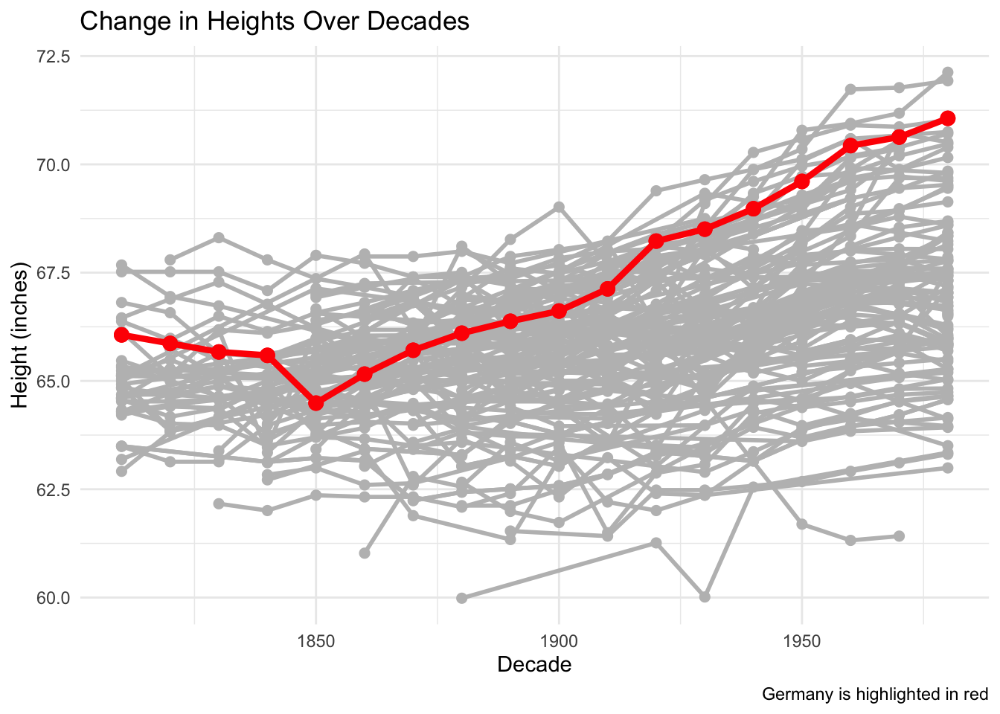

::: {.cell}

```{.r .cell-code}
library(dplyr)
library(tidyr)
library(readxl)

heights_data = read_excel("Height.xlsx")
heights_data
```

::: {.cell-output .cell-output-stdout}

```
# A tibble: 306 × 203
    Code Continent_Region_Cou…¹ `1800` `1801` `1802` `1803` `1804` `1805` `1806`
   <dbl> <chr>                  <lgl>  <lgl>  <lgl>  <lgl>  <lgl>  <lgl>  <lgl> 
 1   150 Europe                 NA     NA     NA     NA     NA     NA     NA    
 2   155 Western Europe         NA     NA     NA     NA     NA     NA     NA    
 3    40 Austria                NA     NA     NA     NA     NA     NA     NA    
 4    56 Belgium                NA     NA     NA     NA     NA     NA     NA    
 5   280 Federal Republic of G… NA     NA     NA     NA     NA     NA     NA    
 6   250 France                 NA     NA     NA     NA     NA     NA     NA    
 7   278 German Democratic Rep… NA     NA     NA     NA     NA     NA     NA    
 8   276 Germany                NA     NA     NA     NA     NA     NA     NA    
 9   438 Liechtenstein          NA     NA     NA     NA     NA     NA     NA    
10   442 Luxembourg             NA     NA     NA     NA     NA     NA     NA    
# ℹ 296 more rows
# ℹ abbreviated name: ¹​Continent_Region_Country
# ℹ 194 more variables: `1807` <lgl>, `1808` <lgl>, `1809` <lgl>, `1810` <dbl>,
#   `1811` <lgl>, `1812` <lgl>, `1813` <lgl>, `1814` <lgl>, `1815` <lgl>,
#   `1816` <lgl>, `1817` <lgl>, `1818` <lgl>, `1819` <lgl>, `1820` <dbl>,
#   `1821` <lgl>, `1822` <lgl>, `1823` <lgl>, `1824` <lgl>, `1825` <lgl>,
#   `1826` <lgl>, `1827` <lgl>, `1828` <lgl>, `1829` <lgl>, `1830` <dbl>, …
```


:::
:::

::: {.cell}

```{.r .cell-code}
data <- heights_data %>%
  mutate(Continent = NA, region = NA, country = NA) %>%
  select(Continent, region, country, everything())

continent_values = c("Europe", "Americas", "Africa", "Latin America and the Caribbean", 
                     "Oceania", "Asia")


region_values = c("Western Europe", "Northern Europe", "Southern Europe", "Eastern Europe", 
                  "Northern America", "Caribbean", "Central America", "South America", 
                  "Australia and New Zealand", "Melanesia", "Micronesia", "Polynesia", 
                  "Southern Asia", "Eastern Asia", "South-Eastern Asia", "Western Asia", 
                  "Central Asia", "Northern Africa", "Western Africa", "Middle Africa", 
                  "Southern Africa", "Eastern Africa")
```
:::

::: {.cell}

```{.r .cell-code}
# Continent column
current_continent = NA
for (i in 1:nrow(data)) {
  if (data$Continent_Region_Country[i] %in% continent_values) {
    current_continent = data$Continent_Region_Country[i]
  }
  data$Continent[i] = current_continent
}
```
:::

::: {.cell}

```{.r .cell-code}
# region column
current_region = NA
for (i in 1:nrow(data)) {
  if (data$Continent_Region_Country[i] %in% region_values) {
    current_region = data$Continent_Region_Country[i]
  }
  data$region[i] = current_region
}
```
:::

::: {.cell}

```{.r .cell-code}
# country column
not_country = c(continent_values, region_values)

for (i in 1:nrow(data)) {
  if (!(data$Continent_Region_Country[i] %in% not_country)) {
    data$country[i] = data$Continent_Region_Country[i]
  } else {
    data$country[i] = NA
  }
}
```
:::

::: {.cell}

```{.r .cell-code}
data <- data %>% filter(!is.na(country))

data <- data %>% select(-Continent_Region_Country)
print(data)
```

::: {.cell-output .cell-output-stdout}

```
# A tibble: 257 × 205
   Continent region      country  Code `1800` `1801` `1802` `1803` `1804` `1805`
   <chr>     <chr>       <chr>   <dbl> <lgl>  <lgl>  <lgl>  <lgl>  <lgl>  <lgl> 
 1 Europe    Western Eu… Austria    40 NA     NA     NA     NA     NA     NA    
 2 Europe    Western Eu… Belgium    56 NA     NA     NA     NA     NA     NA    
 3 Europe    Western Eu… Federa…   280 NA     NA     NA     NA     NA     NA    
 4 Europe    Western Eu… France    250 NA     NA     NA     NA     NA     NA    
 5 Europe    Western Eu… German…   278 NA     NA     NA     NA     NA     NA    
 6 Europe    Western Eu… Germany   276 NA     NA     NA     NA     NA     NA    
 7 Europe    Western Eu… Liecht…   438 NA     NA     NA     NA     NA     NA    
 8 Europe    Western Eu… Luxemb…   442 NA     NA     NA     NA     NA     NA    
 9 Europe    Western Eu… Monaco    492 NA     NA     NA     NA     NA     NA    
10 Europe    Western Eu… Nether…   528 NA     NA     NA     NA     NA     NA    
# ℹ 247 more rows
# ℹ 195 more variables: `1806` <lgl>, `1807` <lgl>, `1808` <lgl>, `1809` <lgl>,
#   `1810` <dbl>, `1811` <lgl>, `1812` <lgl>, `1813` <lgl>, `1814` <lgl>,
#   `1815` <lgl>, `1816` <lgl>, `1817` <lgl>, `1818` <lgl>, `1819` <lgl>,
#   `1820` <dbl>, `1821` <lgl>, `1822` <lgl>, `1823` <lgl>, `1824` <lgl>,
#   `1825` <lgl>, `1826` <lgl>, `1827` <lgl>, `1828` <lgl>, `1829` <lgl>,
#   `1830` <dbl>, `1831` <lgl>, `1832` <lgl>, `1833` <lgl>, `1834` <lgl>, …
```


:::
:::

::: {.cell}

```{.r .cell-code}
long_data <- data %>% 
  pivot_longer(
    cols = any_of(c(starts_with("18"), starts_with("19"), starts_with("20"))),
    names_to = "year_decade", 
    values_to = "height.cm"
  )

long_data
```

::: {.cell-output .cell-output-stdout}

```
# A tibble: 51,657 × 6
   Continent region         country  Code year_decade height.cm
   <chr>     <chr>          <chr>   <dbl> <chr>           <dbl>
 1 Europe    Western Europe Austria    40 1800               NA
 2 Europe    Western Europe Austria    40 1801               NA
 3 Europe    Western Europe Austria    40 1802               NA
 4 Europe    Western Europe Austria    40 1803               NA
 5 Europe    Western Europe Austria    40 1804               NA
 6 Europe    Western Europe Austria    40 1805               NA
 7 Europe    Western Europe Austria    40 1806               NA
 8 Europe    Western Europe Austria    40 1807               NA
 9 Europe    Western Europe Austria    40 1808               NA
10 Europe    Western Europe Austria    40 1809               NA
# ℹ 51,647 more rows
```


:::
:::

::: {.cell}

```{.r .cell-code}
filtered_data = long_data %>% filter(!is.na(height.cm))

filtered_data
```

::: {.cell-output .cell-output-stdout}

```
# A tibble: 1,330 × 6
   Continent region         country  Code year_decade height.cm
   <chr>     <chr>          <chr>   <dbl> <chr>           <dbl>
 1 Europe    Western Europe Austria    40 1820             164.
 2 Europe    Western Europe Austria    40 1830             163.
 3 Europe    Western Europe Austria    40 1840             165.
 4 Europe    Western Europe Austria    40 1850             166.
 5 Europe    Western Europe Austria    40 1860             166.
 6 Europe    Western Europe Austria    40 1870             167.
 7 Europe    Western Europe Austria    40 1880             168.
 8 Europe    Western Europe Austria    40 1890             168.
 9 Europe    Western Europe Austria    40 1900             169.
10 Europe    Western Europe Austria    40 1910             169.
# ℹ 1,320 more rows
```


:::
:::

::: {.cell}

```{.r .cell-code}
final_data = filtered_data %>% select(-Continent, -region)

final_data
```

::: {.cell-output .cell-output-stdout}

```
# A tibble: 1,330 × 4
   country  Code year_decade height.cm
   <chr>   <dbl> <chr>           <dbl>
 1 Austria    40 1820             164.
 2 Austria    40 1830             163.
 3 Austria    40 1840             165.
 4 Austria    40 1850             166.
 5 Austria    40 1860             166.
 6 Austria    40 1870             167.
 7 Austria    40 1880             168.
 8 Austria    40 1890             168.
 9 Austria    40 1900             169.
10 Austria    40 1910             169.
# ℹ 1,320 more rows
```


:::
:::

::: {.cell}

```{.r .cell-code}
final_data <- final_data %>%
  select(Code, country, height.cm, year_decade)

final_data
```

::: {.cell-output .cell-output-stdout}

```
# A tibble: 1,330 × 4
    Code country height.cm year_decade
   <dbl> <chr>       <dbl> <chr>      
 1    40 Austria      164. 1820       
 2    40 Austria      163. 1830       
 3    40 Austria      165. 1840       
 4    40 Austria      166. 1850       
 5    40 Austria      166. 1860       
 6    40 Austria      167. 1870       
 7    40 Austria      168. 1880       
 8    40 Austria      168. 1890       
 9    40 Austria      169. 1900       
10    40 Austria      169. 1910       
# ℹ 1,320 more rows
```


:::
:::

::: {.cell}

```{.r .cell-code}
library(ggplot2)

# Convert heights from centimeters to inches
final_data <- final_data %>%
  mutate(height.inches = height.cm / 2.54)

# Create the plot (no colors for country, just highlighting Germany)
ggplot(final_data, aes(x = as.numeric(year_decade), y = height.inches)) +
  geom_line(aes(group = country), color = "gray", size = 1) +
  geom_point(aes(group = country), color = "gray", size = 2) +
  # Highlight Germany's data in red
  geom_line(data = filter(final_data, country %in% c("Germany", "Federal Republic of Germany (until 1990)")), 
            aes(x = as.numeric(year_decade), y = height.inches), color = "red", size = 1.5) +
  geom_point(data = filter(final_data, country %in% c("Germany", "Federal Republic of Germany (until 1990)")), 
             aes(x = as.numeric(year_decade), y = height.inches), color = "red", size = 3) +
  labs(title = "Change in Heights Over Decades", 
       x = "Decade", 
       y = "Height (inches)", 
       caption = "Germany is highlighted in red") +
  theme_minimal()
```

::: {.cell-output-display}
{width=672}
:::
:::


The plot shows a clear trend of increasing human height over the years. The general upward movement of the data points suggests that average heights have grown significantly from the 19th century to the present. Germany, highlighted in red, follows a similar pattern of growth, further reinforcing the claim that humans are getting taller. This trend can likely be attributed to improvements in nutrition, healthcare, and general living conditions. Although the trend holds true for most countries, the rate of height increase varies, implying that external factors such as economic and regional differences may influence height growth over time.


