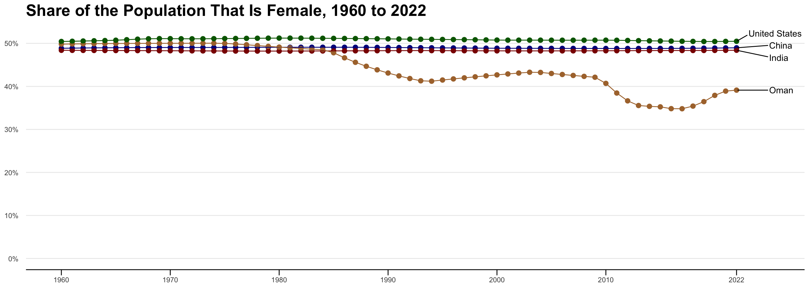

# Link to image I'm recreating: https://ourworldindata.org/grapher/share-population-female?tab=chart


::: {.cell}

```{.r .cell-code}
pacman::p_load(directlabels, gapminder, tidyverse, ggrepel, ggthemes, ggplot2, dplyr, tidyr, scales)

pop_female = read.csv("share_population_female.csv")
```
:::

::: {.cell}

```{.r .cell-code}
colnames(pop_female) <- c("Entity", "Code", "Year", "Population")

pop_f_counties = pop_female %>% 
  filter(Entity %in% c("United States", "China", "India", "Oman"))
```
:::

::: {.cell}

```{.r .cell-code}
label_data <- pop_f_counties %>%
  group_by(Entity) %>%
  filter(Year == max(Year))

ggplot(pop_f_counties, aes(x = Year, y = Population)) +
  geom_point(aes(color = Entity), size = 2.5, alpha = 1) +
  geom_line(aes(color = Entity)) +
  
  scale_color_manual(values = c("United States" = "darkgreen", "China" = "darkblue", "India" = "darkred", "Oman" = "#ac7339")) +
  
  scale_y_continuous(
    breaks = c(0, 10, 20, 30, 40, 50),  
    limits = c(0, 52),  
    labels = scales::label_number(suffix = "%")) +
  
  scale_x_continuous(
    breaks = c(1960, 1970, 1980, 1990, 2000, 2010, 2022),  
    limits = c(1960, 2025)) +  
  
  geom_text_repel(data = label_data, aes(label = Entity),
      nudge_x = 3, hjust = 0, direction = "y") +
  
  theme_minimal() +
  theme(
    panel.grid.major.x = element_blank(),  
    panel.grid.minor.x = element_blank(),  
    panel.grid.minor.y = element_blank(),  
    axis.line.x = element_line(color = "black", size = 0.5), 
    axis.title.y = element_blank(),
    axis.ticks.length = unit(0.25, "cm"),
    axis.ticks.length.x = unit(0.25, "cm"),  
    axis.ticks.x = element_line(color = "black"),
    legend.position = "none",
    plot.title = element_text(size = 20, face = "bold" ),
    axis.title.x = element_blank()) +
    
  labs(
    title = "Share of the Population That Is Female, 1960 to 2022"
  )
```

::: {.cell-output-display}
{width=1344}
:::
:::
