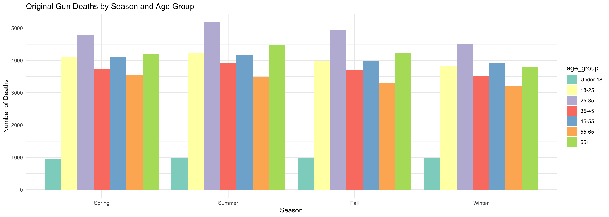
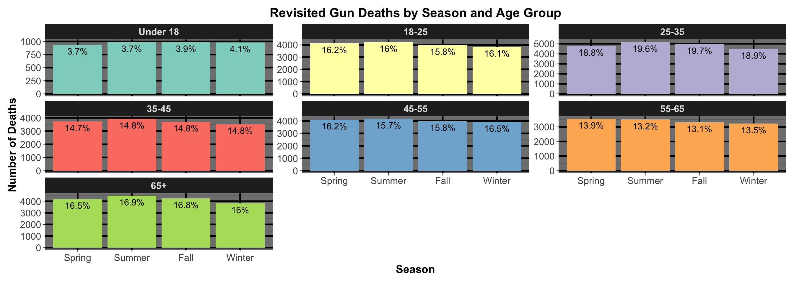
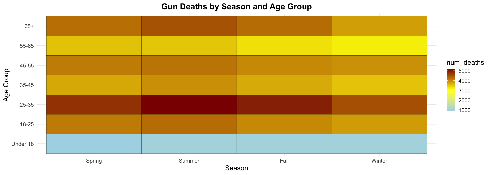
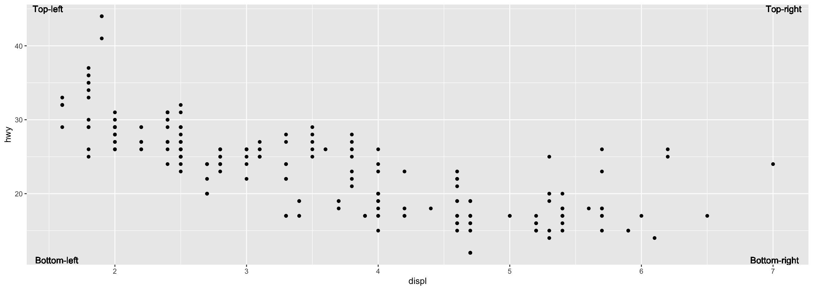
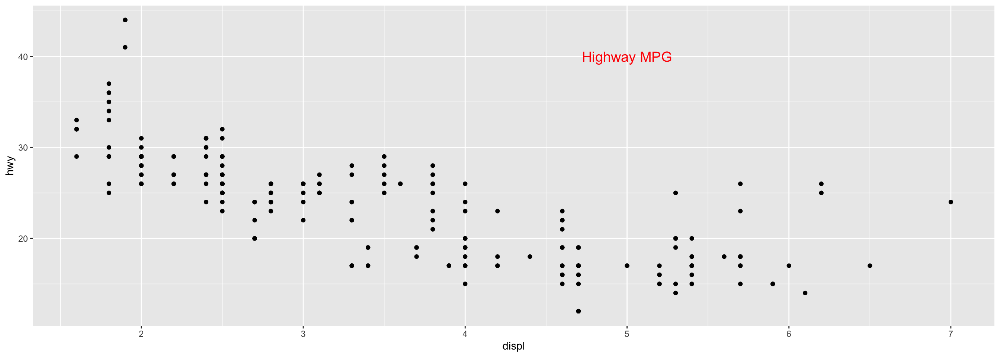
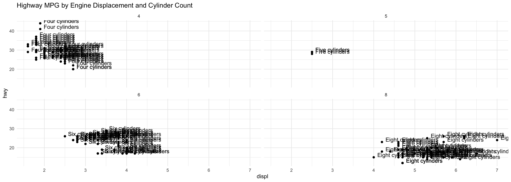
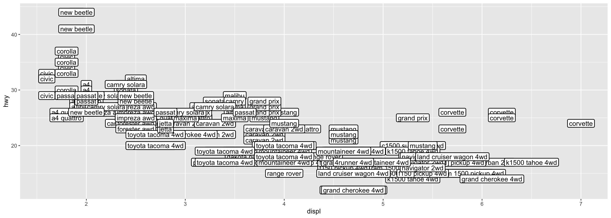

# Revisited gun deaths charts

::: {.cell}

```{.r .cell-code}
pacman::p_load(directlabels, gapminder, tidyverse, ggrepel, ggthemes, ggplot2, dplyr, patchwork, RColorBrewer, )

og_gun_data <- read_csv('https://raw.githubusercontent.com/fivethirtyeight/guns-data/refs/heads/master/full_data.csv') %>%
  mutate(month = as.numeric(month))
og_gun_data <- og_gun_data %>%
  mutate(season = case_when(month %in% c(12, 01, 02) ~ "Winter", month %in% c(03, 04, 05) ~ "Spring", month %in% c(06, 07, 08) ~ "Summer", month %in% c(09, 10, 11) ~ "Fall" ))
```
:::


## Original chart

::: {.cell}

```{.r .cell-code}
gun_deaths_by_age_season <- og_gun_data %>%
  mutate(age_group = case_when(
    age < 18 ~ "Under 18",
    age >= 18 & age < 25 ~ "18-25",
    age >= 25 & age < 35 ~ "25-35",
    age >= 35 & age < 45 ~ "35-45",
    age >= 45 & age < 55 ~ "45-55",
    age >= 55 & age < 65 ~ "55-65",
    age >= 65 ~ "65+",
    TRUE ~ NA_character_  
  )) %>%
  filter(!is.na(age_group)) %>%  
  group_by(season, age_group) %>%
  summarise(num_deaths = n(), .groups = 'drop') %>%
  mutate(age_group = factor(age_group, levels = c("Under 18", "18-25", "25-35", "35-45", "45-55", "55-65", "65+")),
         season = factor(season, levels = c("Spring", "Summer", "Fall", "Winter")))  

ggplot(gun_deaths_by_age_season, aes(x = season, y = num_deaths, fill = age_group)) +
  geom_bar(stat = "identity", position = "dodge") +
  labs(title = "Original Gun Deaths by Season and Age Group", x = "Season", y = "Number of Deaths") +
  scale_fill_brewer(palette = "Set3") +  
  theme_minimal()
```

::: {.cell-output-display}
{width=1344}
:::

```{.r .cell-code}
filtered_data <- gun_deaths_by_age_season %>%
  filter(is.na(age_group))  
```
:::

::: {.cell}

```{.r .cell-code}
gun_deaths_by_age_season <- og_gun_data %>%
  mutate(age_group = case_when(
    age < 18 ~ "Under 18",
    age >= 18 & age < 25 ~ "18-25",
    age >= 25 & age < 35 ~ "25-35",
    age >= 35 & age < 45 ~ "35-45",
    age >= 45 & age < 55 ~ "45-55",
    age >= 55 & age < 65 ~ "55-65",
    age >= 65 ~ "65+",
    TRUE ~ NA_character_  
  )) %>%
  group_by(season, age_group) %>%
  summarise(num_deaths = n(), .groups = 'drop') %>%
  filter(!is.na(age_group)) %>%
  group_by(season) %>%
  mutate(total_deaths = sum(num_deaths)) %>%
  ungroup() %>%
  mutate(percentage = (num_deaths / total_deaths) * 100) %>%
  mutate(age_group = factor(age_group, levels = c("Under 18", "18-25", "25-35", "35-45", "45-55", "55-65", "65+")),
         season = factor(season, levels = c("Spring", "Summer", "Fall", "Winter")))  
```
:::


## Revisited chart fixed up to look better and be better

::: {.cell}

```{.r .cell-code}
ggplot(gun_deaths_by_age_season, aes(x = season, y = num_deaths, fill = age_group)) +
  geom_bar(stat = "identity", position = "dodge") +
  geom_text(aes(label = paste0(round(percentage, 1), "%")), 
            position = position_dodge(width = 0.9), 
            vjust = 1.5,  
            hjust = 0.5,  
            size = 4, 
            color = "black") +  
  facet_wrap(~ age_group, scales = "free_y") +
  labs(title = "Revisited Gun Deaths by Season and Age Group",
       x = "Season", y = "Number of Deaths") +
  scale_fill_brewer(palette = "Set3") +
  theme_dark() +
  theme(legend.position = "none", 
        plot.title = element_text(hjust = 0.5, face = "bold", size = 16),
        strip.text = element_text(size = 12, face = "bold"),
      axis.title.x = element_text(face = "bold", size = 14),
        axis.title.y = element_text(face = "bold", size = 14),
        axis.text.x = element_text(size = 12),
        axis.text.y = element_text(size = 12),
        panel.grid.major = element_line(size = 1, linetype = 'solid', color = "black"), 
        plot.margin = margin(10, 10, 10, 10))
```

::: {.cell-output-display}
{width=1344}
:::

```{.r .cell-code}
        axis.text.x = element_text(size = 12, hjust = 100, vjust = 0)  
```
:::


# New type of chart that better illustrates the story

::: {.cell}

```{.r .cell-code}
ggplot(gun_deaths_by_age_season, aes(x = season, y = age_group, fill = num_deaths)) +
  geom_tile(color = "black") +
  scale_fill_gradientn(colors = c("lightblue", "yellow", "darkred")) +  
  labs(title = "Gun Deaths by Season and Age Group", x = "Season", y = "Age Group") +
  theme_minimal(base_size = 14) +
  theme(legend.position = "right",
        plot.title = element_text(hjust = 0.5, face = "bold"))
```

::: {.cell-output-display}
{width=1344}
:::
:::


# 28.3.1 Exercises

[**1. Use geom_text() with infinite positions to place text at the four
corners of the plot.**]{.underline}


::: {.cell}

```{.r .cell-code}
library(ggplot2)

ggplot(mpg, aes(x = displ, y = hwy)) +
  geom_point() +
  geom_text(aes(x = -Inf, y = Inf, label = "Top-left"), hjust = -0.2, vjust = 1.2) +
  geom_text(aes(x = Inf, y = Inf, label = "Top-right"), hjust = 1.2, vjust = 1.2) +
  geom_text(aes(x = -Inf, y = -Inf, label = "Bottom-left"), hjust = -0.2, vjust = -0.2) +
  geom_text(aes(x = Inf, y = -Inf, label = "Bottom-right"), hjust = 1.2, vjust = -0.2)
```

::: {.cell-output-display}
{width=1344}
:::

```{.r .cell-code}
  #geom_dl(aes(label = Species), method = "smart.grid") +
```
:::


[**2. Read the documentation for annotate(). How can you use it to add a
text label to a plot without having to create a tibble?**]{.underline}

The annotate() function allows you to directly add annotations without
needing to create a separate data frame or tibble. It just kind of let's
you.


::: {.cell}

```{.r .cell-code}
ggplot(mpg, aes(x = displ, y = hwy)) + 
  geom_point() + 
  annotate("text", x= 5, y = 40, label = "Highway MPG", size = 5, colour = "red")
```

::: {.cell-output-display}
{width=1344}
:::
:::


[**3. How do labels with geom_text() interact with faceting? How can you
add a label to a single facet? How can you put a different label in each
facet?**]{.underline}

Labels with geom_text() work with faceting by being applied to all
facets. If you want to add different labels to each facet, you'll need
to include the label in the data.


::: {.cell}

```{.r .cell-code}
facet_data <- mpg
facet_data$label <- ifelse(facet_data$cyl == 4, "Four cylinders",
                    ifelse(facet_data$cyl == 5, "Five cylinders",  
                    ifelse(facet_data$cyl == 6, "Six cylinders",
                    ifelse(facet_data$cyl == 8, "Eight cylinders", NA))))
ggplot(facet_data, aes(x = displ, y = hwy)) + 
  geom_point() +
  geom_text(aes(label = label), na.rm = TRUE, hjust = -0.1, vjust = -0.1) +  
  facet_wrap(~cyl) +
  labs(title = "Highway MPG by Engine Displacement and Cylinder Count") +
  theme_minimal()
```

::: {.cell-output-display}
{width=1344}
:::
:::


[**4. What arguments to geom_label() control the appearance of the
background box?**]{.underline}

Some arguments that control the appearance of the background box in
geom_label() are:

-   label.padding: Padding around the label, a unit object.

-   label.size: Size of the label border.

-   label.r: Corner radius for rounded corners of the label.


::: {.cell}

```{.r .cell-code}
ggplot(mpg, aes(x = displ, y = hwy)) + geom_point() +
  geom_label(aes(label = model),
    label.padding = unit(0.2, "lines"),
    label.size = 0.5,
    label.r = unit(0.15, "lines"))
```

::: {.cell-output-display}
{width=1344}
:::
:::


[**5. What are the four arguments to arrow()? How do they work? Create a
series of plots that demonstrate the most important
options.**]{.underline}

Four arguments to arrow() are:

-   angle: Angle of the arrowhead in degrees.

-   length: Length of the arrowhead.

-   ends: Which end the arrow should be drawn on. Options are "first",
    "last", or "both".

-   type: Type of arrowhead. Options are "open" or "closed".


::: {.cell}

```{.r .cell-code}
ggplot(mpg, aes(x = displ, y = hwy)) + 
  geom_point() + 
  geom_segment(aes(x= 2, y = 30, xend = 5, yend = 40), arrow = arrow(angle = 30, length =unit(0.3, "inches"), ends = "last", type ="closed")) +
geom_segment(aes(x = 2, y = 20, xend = 5, yend = 25), arrow =arrow(angle = 90, length = unit(0.4, "inches"), ends = "first", type ="open"))
```

::: {.cell-output-display}
{width=1344}
:::
:::
