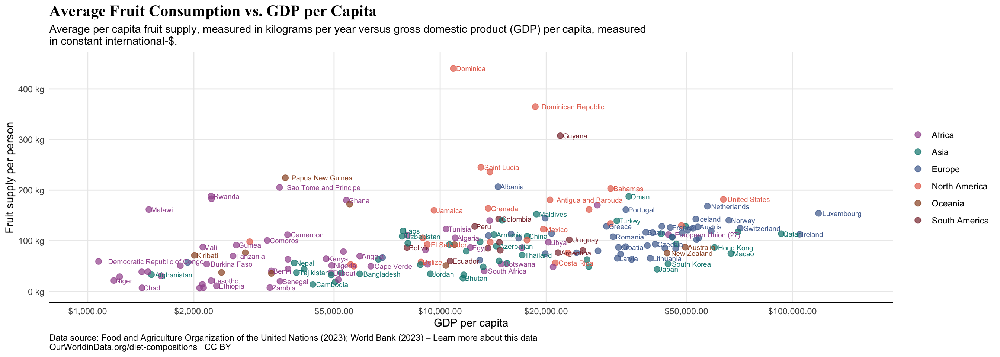
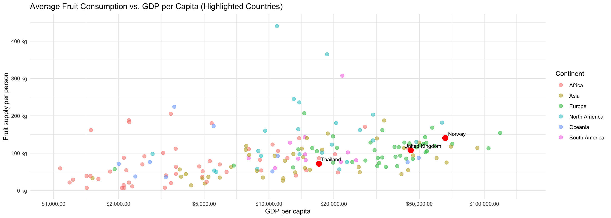
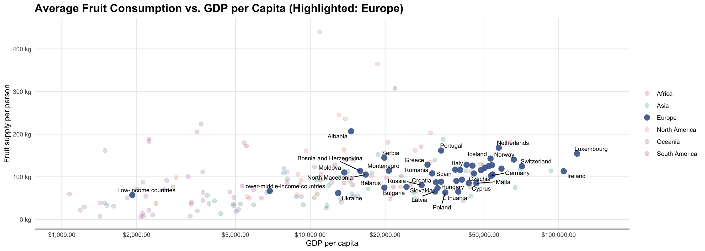

# Step 1


::: {.cell}

```{.r .cell-code}
pacman::p_load(directlabels, gapminder, tidyverse, ggrepel, ggthemes, ggplot2, dplyr, tidyr, scales)

fruit <- read.csv("fruit_vs-gdp_capita.csv")

colnames(fruit) <- c("Entity", "Code", "Year", "Fruit_consumption", "GDP_per_capita", "Continent")
fruit$Year <- as.numeric(as.character(fruit$Year))
fruit$Fruit_consumption <- as.numeric(as.character(fruit$Fruit_consumption))

fruit$Continent[fruit$Continent == ""] <- NA
fruit <- fruit %>%
  fill(Continent, .direction = "down")

head(fruit)
```

::: {.cell-output .cell-output-stdout}

```
       Entity     Code Year Fruit_consumption GDP_per_capita Continent
1    Abkhazia OWID_ABK 2015                NA             NA      Asia
2 Afghanistan      AFG 1961          41.89672             NA      Asia
3 Afghanistan      AFG 1962          38.73273             NA      Asia
4 Afghanistan      AFG 1963          39.01244             NA      Asia
5 Afghanistan      AFG 1964          48.90083             NA      Asia
6 Afghanistan      AFG 1965          49.70729             NA      Asia
```


:::
:::

::: {.cell}

```{.r .cell-code}
fruit$Continent[fruit$Continent == ""] <- NA

fruit <- fruit %>%
  fill(Continent, .direction = "down") %>% 
    filter(Year == 2021)

fruit_avg <- fruit %>%
  group_by(Entity, Continent) %>%
  summarize(
    avg_fruit_consumption = mean(Fruit_consumption, na.rm = TRUE),
    avg_gdp_per_capita = mean(GDP_per_capita, na.rm = TRUE) )
```
:::

::: {.cell}

```{.r .cell-code}
continent_colors = c("Africa" = "#a2559c", "Asia" = "#00847e", "Europe" = "#4c6a9c", "North America" = "#e66e5a", "Oceania" = "#9a5129", "South America" = "#883039")

fruit = fruit %>% 
  filter(Continent != "Antarctica")


  ggplot(fruit_avg, aes(x = avg_gdp_per_capita, y = avg_fruit_consumption, color = Continent)) +
  geom_point(size = 2.5, alpha = 0.7) +
  
  geom_text(
    aes(label = Entity),
    size = 2.5,
    hjust = -0.1,
    vjust = 0.5,
    check_overlap = TRUE,
    show.legend = FALSE) +
  
  scale_x_log10(
    labels = dollar_format(scale = 1, suffix = "", prefix = "$"),  
    breaks = c(1000, 2000, 5000, 10000, 20000, 50000, 100000),
    limits = c(1000, 150000)) +  # Set limits for the x-axis
  
  scale_y_continuous(
    labels = function(x) paste0(x, " kg"),
    breaks = seq(0, 400, by = 100),
    limits = c(0, 450)) +
  
  scale_color_manual(values = continent_colors) +
  
  labs(
    x = "GDP per capita",
    y = "Fruit supply per person",  
    title = "Average Fruit Consumption vs. GDP per Capita",
    subtitle = "Average per capita fruit supply, measured in kilograms per year versus gross domestic product (GDP) per capita, measured
in constant international-$.",
    caption = "Data source: Food and Agriculture Organization of the United Nations (2023); World Bank (2023) – Learn more about this data
OurWorldinData.org/diet-compositions | CC BY"
  ) +  

  theme_minimal() +
  theme(
    panel.grid.minor = element_blank(),  
    axis.text.x = element_text(angle = 0, hjust = 0.5),  
    plot.title = element_text(size = 16, face = "bold", hjust = 0, family = "Times New Roman"),
    legend.position = "right",  
    legend.title = element_blank(),  
    plot.caption = element_text(hjust = 0),  
    axis.line.x = element_line(color = "black", size = 0.5)) +  

  coord_cartesian(clip = "off")  
```

::: {.cell-output-display}
{width=1344}
:::
:::


# Step 2


::: {.cell}

```{.r .cell-code}
# Select the countries you want to highlight
highlight_countries <- c("Thailand", "United Kingdom", "Norway")

ggplot(fruit_avg, aes(x = avg_gdp_per_capita, y = avg_fruit_consumption, color = Continent)) +
  geom_point(size = 2.5, alpha = 0.5) +
  
  geom_point(data = fruit_avg %>% filter(Entity %in% highlight_countries),
             aes(x = avg_gdp_per_capita, y = avg_fruit_consumption), 
             color = "red", size = 4) +
  
  geom_text_repel(
    data = fruit_avg %>% filter(Entity %in% highlight_countries),
    aes(label = Entity),
    size = 3, color = "black") +
  
  scale_x_log10(
    labels = dollar_format(scale = 1, suffix = "", prefix = "$"),
    breaks = c(1000, 2000, 5000, 10000, 20000, 50000, 100000),
    limits = c(1000, 150000)) +
  
  scale_y_continuous(
    labels = function(x) paste0(x, " kg"),
    breaks = seq(0, 400, by = 100),
    limits = c(0, 450)) +
  
  labs(
    x = "GDP per capita",
    y = "Fruit supply per person",
    title = "Average Fruit Consumption vs. GDP per Capita (Highlighted Countries)"
  ) +
  theme_minimal()
```

::: {.cell-output-display}
{width=1344}
:::
:::


# Step 3


::: {.cell}

```{.r .cell-code}
# Filter the data for highlighting Europe
highlight_continent <- "Europe"

ggplot(fruit_avg, aes(x = avg_gdp_per_capita, y = avg_fruit_consumption)) +
  # Add points for all continents but reduce their visibility
  geom_point(data = fruit_avg, aes(color = Continent), size = 2.5, alpha = 0.2) +
  
  # Highlight Europe with a different color and size
  geom_point(data = fruit_avg %>% filter(Continent == highlight_continent),
             aes(color = Continent), size = 3.5, alpha = 0.9) +
  
  geom_text_repel(
    data = fruit_avg %>% filter(Continent == highlight_continent),
    aes(label = Entity),
    size = 3, color = "black") +
  
  scale_x_log10(
    labels = dollar_format(scale = 1, suffix = "", prefix = "$"),
    breaks = c(1000, 2000, 5000, 10000, 20000, 50000, 100000),
    limits = c(1000, 150000)) +
  
  scale_y_continuous(
    labels = function(x) paste0(x, " kg"),
    breaks = seq(0, 400, by = 100),
    limits = c(0, 450)) +
  
  scale_color_manual(values = continent_colors) +
  
  labs(
    x = "GDP per capita",
    y = "Fruit supply per person",
    title = "Average Fruit Consumption vs. GDP per Capita (Highlighted: Europe)"
  ) +
  theme_minimal() +
  theme(
    panel.grid.minor = element_blank(),
    axis.text.x = element_text(angle = 0, hjust = 0.5),
    plot.title = element_text(size = 16, face = "bold", hjust = 0),
    legend.position = "right",
    legend.title = element_blank(),
    plot.caption = element_text(hjust = 0),
    axis.line.x = element_line(color = "black", size = 0.5)
  ) +
  coord_cartesian(clip = "off")
```

::: {.cell-output-display}
{width=1344}
:::
:::


# Step 4

Paragraph: Insights and Reflections

In this task, I learned how to effectively use highlighting techniques to draw attention to specific elements in a dataset. For example, when focusing on a single continent, such as Europe, I applied color and size adjustments to make European countries stand out while dimming other regions. This approach allows the audience to immediately focus on the comparison between countries within Europe and others across different GDP per capita levels.

Moreover, I learned about using geom_text_repel to label points without overcrowding the plot, which is helpful in maintaining clarity when dealing with numerous data points. The filter function also proved essential in narrowing down data for specific continents, allowing precise control over which data gets highlighted.

Highlighting, in general, helps data tell a more focused story. By emphasizing specific aspects, such as regions or countries, I can lead the audience to gain insights more efficiently, helping them interpret key trends without getting lost in the noise of other data points. This strategy is powerful when trying to convey specific messages in presentations or reports.


