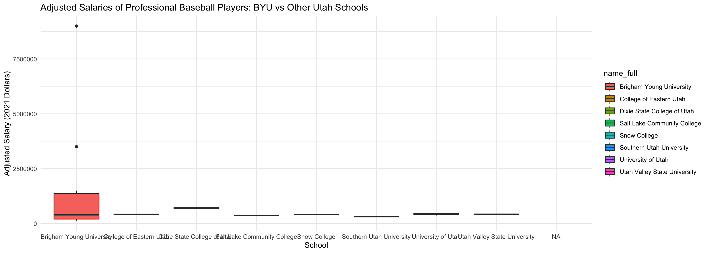
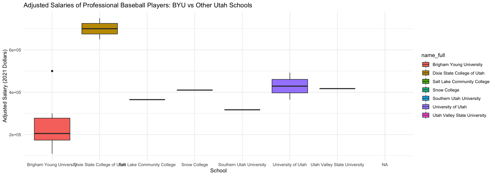
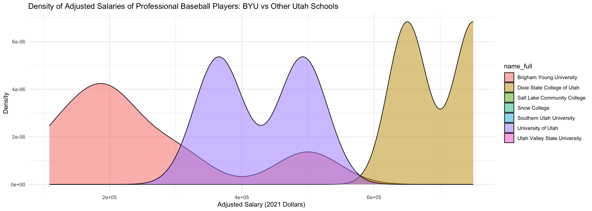
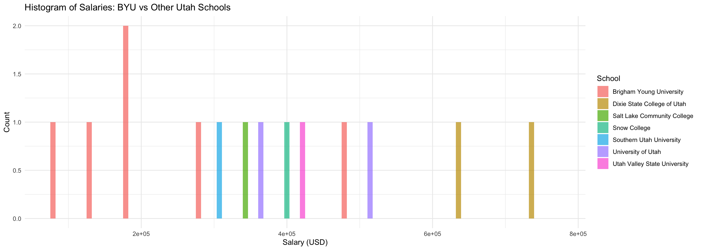
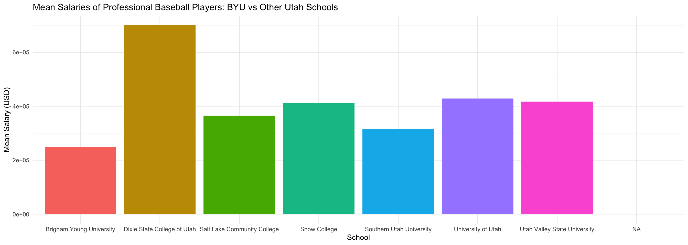

::: {.cell}

```{.r .cell-code}
if (!require("blscrapeR")) install.packages("blscrapeR")
library(priceR)
library(Lahman)
library(dplyr)
library(blscrapeR)
library(ggplot2)
```
:::

::: {.cell}

```{.r .cell-code}
salaries_data <- Salaries %>%
  group_by(playerID) %>%
  summarize(yearID = max(yearID), # Get the latest year
            salary = last(salary), # Get the most recent salary
            .groups = 'drop')

players_data = People

college_data <- CollegePlaying %>%
  distinct(playerID, schoolID) 

schools_data <- Schools

merged_data <- merge(salaries_data, players_data, by = "playerID")
merged_data <- merge(merged_data, college_data, by = "playerID", all.x = TRUE) # Use all.x to keep all salaries
merged_data <- merge(merged_data, schools_data, by = "schoolID", all.x = TRUE) # Merge with Schools data

final_data <- merged_data[, c("nameFirst", "nameLast", "yearID", "salary", "schoolID", "name_full", "state")]

head(final_data)
```

::: {.cell-output .cell-output-stdout}

```
  nameFirst  nameLast yearID   salary schoolID             name_full state
1      Mike  Birkbeck   1990   155000    akron   University of Akron    OH
2     Randy      Hunt   1986    65000  alabama University of Alabama    AL
3      Josh  Rutledge   2014   501000  alabama University of Alabama    AL
4      Alex     Avila   2016  2500000  alabama University of Alabama    AL
5     Lance   Cormier   2011  1200000  alabama University of Alabama    AL
6     David Robertson   2016 11000000  alabama University of Alabama    AL
```


:::
:::

::: {.cell}

```{.r .cell-code}
final_data <- final_data %>%
  mutate(salary_adjusted = adjust_for_inflation(price = salary, from_date = yearID, country = "US", to_date = 2021))
```

::: {.cell-output .cell-output-stdout}

```
Generating URL to request all 296 results
Retrieving inflation data for US 
Generating URL to request all 64 results
```


:::

```{.r .cell-code}
head(final_data)
```

::: {.cell-output .cell-output-stdout}

```
  nameFirst  nameLast yearID   salary schoolID             name_full state
1      Mike  Birkbeck   1990   155000    akron   University of Akron    OH
2     Randy      Hunt   1986    65000  alabama University of Alabama    AL
3      Josh  Rutledge   2014   501000  alabama University of Alabama    AL
4      Alex     Avila   2016  2500000  alabama University of Alabama    AL
5     Lance   Cormier   2011  1200000  alabama University of Alabama    AL
6     David Robertson   2016 11000000  alabama University of Alabama    AL
  salary_adjusted
1        321451.5
2        160690.6
3        573447.8
4       2822517.3
5       1445562.8
6      12419076.0
```


:::
:::

::: {.cell}

```{.r .cell-code}
#final_data$yearID <- as.numeric(as.character(final_data$yearID))
#earnings_vector <- final_data$salary
#years_vector <- final_data$yearID

#adjusted_earnings <- adjust_for_inflation(price = earnings_vector, from_date = years_vector, country = "US", to_date = 2021)

#final_data$adjusted_salary <- adjusted_earnings
```
:::

::: {.cell}

```{.r .cell-code}
byu_data <- final_data[final_data$name_full == "Brigham Young University", ] 
other_utah_schools <- final_data[final_data$name_full != "Brigham Young University" & final_data$name_full != "College of Eastern Utah" & final_data$state == "UT", ]

# Combine datasets for comparison
comparison_data <- rbind(byu_data, other_utah_schools)

comparison_data <- comparison_data[comparison_data$salary < 1000000, ] 
```
:::

::: {.cell}

```{.r .cell-code}
byu_data <- final_data[final_data$name_full == "Brigham Young University", ] 
other_utah_schools <- final_data[final_data$name_full != "Brigham Young University" & final_data$state == "UT", ]

# Combine datasets for comparison
comparison_data_1 <- rbind(byu_data, other_utah_schools)
```
:::

::: {.cell}

```{.r .cell-code}
ggplot(comparison_data_1, aes(x = name_full, y = salary, fill = name_full)) +
  geom_boxplot() +
  labs(title = "Adjusted Salaries of Professional Baseball Players: BYU vs Other Utah Schools",
       x = "School",
       y = "Adjusted Salary (2021 Dollars)") +
  theme_minimal()
```

::: {.cell-output-display}
{width=1344}
:::
:::

*I took out the outliers so that it could be analyzed better.
<br><br>


::: {.cell}

```{.r .cell-code}
ggplot(comparison_data, aes(x = name_full, y = salary, fill = name_full)) +
  geom_boxplot() +
  labs(title = "Adjusted Salaries of Professional Baseball Players: BYU vs Other Utah Schools",
       x = "School",
       y = "Adjusted Salary (2021 Dollars)") +
  theme_minimal()
```

::: {.cell-output-display}
{width=1344}
:::
:::

::: {.cell}

```{.r .cell-code}
ggplot(comparison_data, aes(x = salary, fill = name_full)) +
  geom_density(alpha = 0.5) +
  labs(title = "Density of Adjusted Salaries of Professional Baseball Players: BYU vs Other Utah Schools",
       x = "Adjusted Salary (2021 Dollars)",
       y = "Density") +
  theme_minimal()
```

::: {.cell-output-display}
{width=1344}
:::
:::

::: {.cell}

```{.r .cell-code}
ggplot(comparison_data, aes(x = salary, fill = name_full)) +
  geom_histogram(binwidth = 50000, position = "dodge", alpha = 0.7) +
  labs(title = "Histogram of Salaries: BYU vs Other Utah Schools",
       x = "Salary (USD)",
       y = "Count") +
  theme_minimal() +
  scale_fill_discrete(name = "School")
```

::: {.cell-output-display}
{width=1344}
:::
:::

::: {.cell}

```{.r .cell-code}
mean_salary <- comparison_data %>%
  group_by(name_full) %>%
  summarize(mean_salary = mean(salary, na.rm = TRUE))

ggplot(mean_salary, aes(x = name_full, y = mean_salary, fill = name_full)) +
  geom_bar(stat = "identity") +
  labs(title = "Mean Salaries of Professional Baseball Players: BYU vs Other Utah Schools",
       x = "School",
       y = "Mean Salary (USD)") +
  theme_minimal() +
  theme(legend.position = "none")
```

::: {.cell-output-display}
{width=1344}
:::
:::
