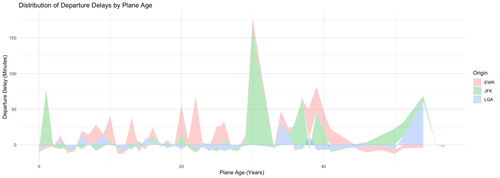
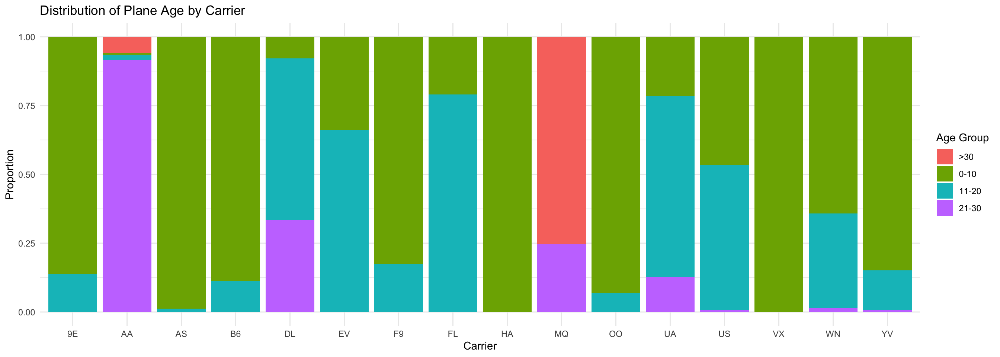
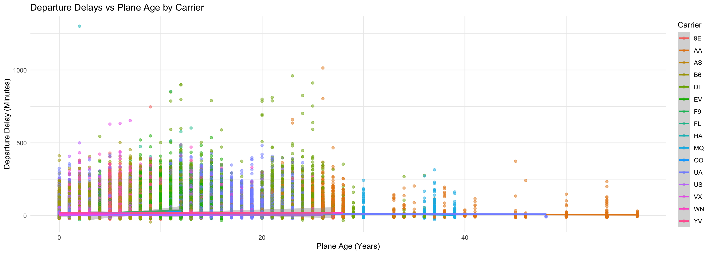
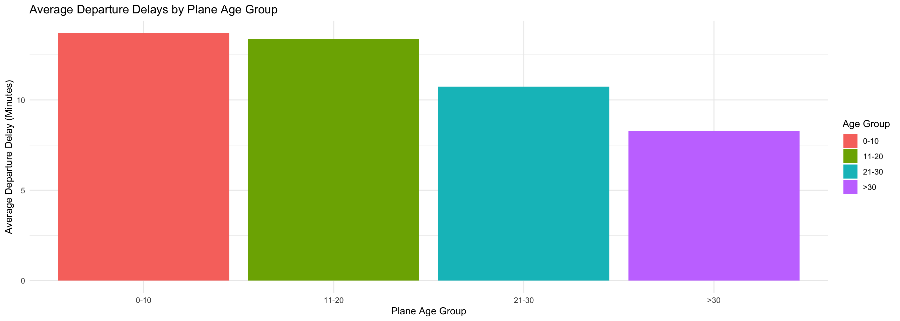
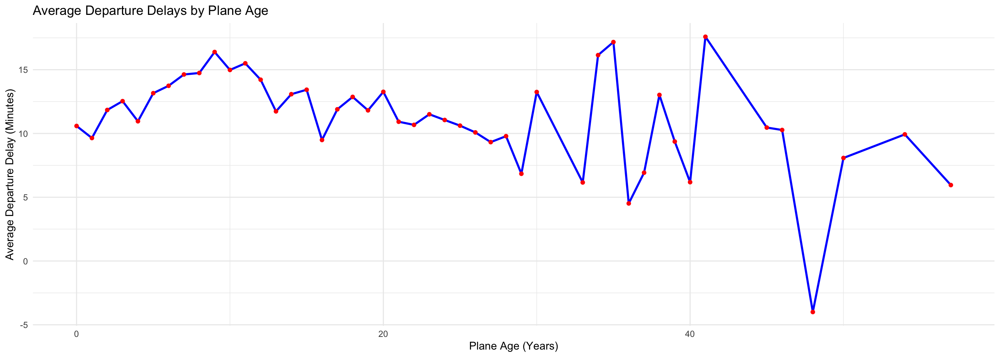

::: {.cell}

```{.r .cell-code}
pacman::p_load(directlabels, gapminder, tidyverse, ggrepel, ggthemes, rio, plotly, nycflights13)
```
:::

::: {.cell}

```{.r .cell-code}
age_data = flights %>% 
  left_join(planes, by = join_by(tailnum), suffix = c("_flight", "_mfct"))

age_data
```

::: {.cell-output .cell-output-stdout}

```
# A tibble: 336,776 × 27
   year_flight month   day dep_time sched_dep_time dep_delay arr_time
         <int> <int> <int>    <int>          <int>     <dbl>    <int>
 1        2013     1     1      517            515         2      830
 2        2013     1     1      533            529         4      850
 3        2013     1     1      542            540         2      923
 4        2013     1     1      544            545        -1     1004
 5        2013     1     1      554            600        -6      812
 6        2013     1     1      554            558        -4      740
 7        2013     1     1      555            600        -5      913
 8        2013     1     1      557            600        -3      709
 9        2013     1     1      557            600        -3      838
10        2013     1     1      558            600        -2      753
# ℹ 336,766 more rows
# ℹ 20 more variables: sched_arr_time <int>, arr_delay <dbl>, carrier <chr>,
#   flight <int>, tailnum <chr>, origin <chr>, dest <chr>, air_time <dbl>,
#   distance <dbl>, hour <dbl>, minute <dbl>, time_hour <dttm>,
#   year_mfct <int>, type <chr>, manufacturer <chr>, model <chr>,
#   engines <int>, seats <int>, speed <int>, engine <chr>
```


:::
:::

::: {.cell}

```{.r .cell-code}
age_data = age_data %>% 
    left_join(planes, by = join_by(tailnum), suffix = c("_flight", "_mfct")) %>% 
    mutate(
      plane_age = (year_flight - year_mfct)) %>% 
    select(tailnum, plane_age, dep_delay, origin, carrier) %>% 
      drop_na %>% 
      mutate(
        age_group = case_when(
          plane_age < 11 ~ "0-10",
          plane_age < 21 ~ "11-20",
          plane_age < 31 ~ "21-30",
          TRUE ~ ">30"
        )
      )
    
names(age_data)
```

::: {.cell-output .cell-output-stdout}

```
[1] "tailnum"   "plane_age" "dep_delay" "origin"    "carrier"   "age_group"
```


:::
:::

::: {.cell}

```{.r .cell-code}
ggplot(age_data, aes(x = plane_age, y = dep_delay, fill = origin)) +
  geom_area(alpha = 0.3) +
  labs(title = "Distribution of Departure Delays by Plane Age",
       x = "Plane Age (Years)",
       y = "Departure Delay (Minutes)",
       fill = "Origin") +
  theme_minimal()
```

::: {.cell-output-display}
{width=1344}
:::

```{.r .cell-code}
age_data_with_airlines = age_data %>% 
  left_join(airlines, by = "carrier")

ggplot(age_data_with_airlines, aes(x = carrier, fill = age_group)) +
  geom_bar(position = "fill") +
  labs(title = "Distribution of Plane Age by Carrier",
       x = "Carrier",
       y = "Proportion",
       fill = "Age Group") +
  theme_minimal()
```

::: {.cell-output-display}
{width=1344}
:::

```{.r .cell-code}
ggplot(age_data_with_airlines, aes(x = plane_age, y = dep_delay, color = carrier)) +
  geom_point(alpha = 0.5) +
  geom_smooth(method = "lm") +
  labs(title = "Departure Delays vs Plane Age by Carrier",
       x = "Plane Age (Years)",
       y = "Departure Delay (Minutes)",
       color = "Carrier") +
  theme_minimal()
```

::: {.cell-output-display}
{width=1344}
:::
:::

::: {.cell}

```{.r .cell-code}
average_delay_by_age_group = age_data %>%
  group_by(age_group) %>%
  summarize(average_dep_delay = mean(dep_delay, na.rm = TRUE)) %>%
  mutate(age_group = factor(age_group, levels = c("0-10", "11-20", "21-30", ">30")))

ggplot(average_delay_by_age_group, aes(x = age_group, y = average_dep_delay, fill = age_group)) +
  geom_bar(stat = "identity") +
  labs(title = "Average Departure Delays by Plane Age Group",
       x = "Plane Age Group",
       y = "Average Departure Delay (Minutes)",
       fill = "Age Group") +
  theme_minimal()
```

::: {.cell-output-display}
{width=1344}
:::
:::

::: {.cell}

```{.r .cell-code}
average_delay_by_age = age_data %>%
  group_by(plane_age) %>%
  summarize(average_dep_delay = mean(dep_delay, na.rm = TRUE), .groups = 'drop')  

ggplot(average_delay_by_age, aes(x = plane_age, y = average_dep_delay)) +
  geom_line(color = "blue", size = 1) +  
  geom_point(color = "red") +  
  labs(
    title = "Average Departure Delays by Plane Age",
    x = "Plane Age (Years)",
    y = "Average Departure Delay (Minutes)"
  ) +
  theme_minimal()
```

::: {.cell-output-display}
{width=1344}
:::
:::


The analysis is reather confusing, for some reason there is a big dip of older planes at one age. This is mmostly an outlier, however it is intoresting, beecouse it dose make is seame llike the younger the plane the worest iit is, but this is probably just becouse there are more younger planes and there aren't enought data points for the older planes...


