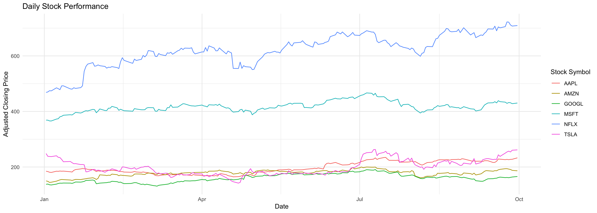
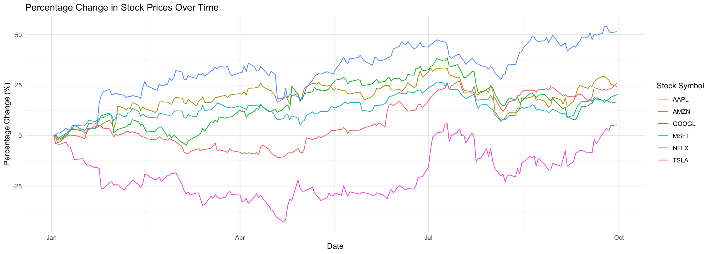
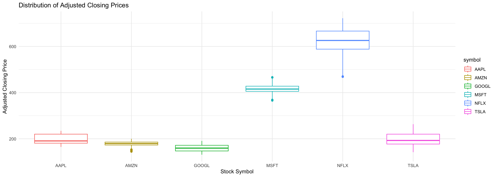

::: {.cell}

```{.r .cell-code}
pacman::p_load(tidyquant, tidyverse, ggplot2, ggrepel, reshape2)
```
:::

::: {.cell}

```{.r .cell-code}
friend_stocks <- c("AAPL", "GOOGL", "AMZN")
my_stocks <- c("MSFT", "TSLA", "NFLX")

all_stocks <- c(friend_stocks, my_stocks)

stock_data <- tq_get(all_stocks, from = "2024-01-01", to = "2024-10-01")

#head(stock_data)
```
:::

::: {.cell}

```{.r .cell-code}
ggplot(stock_data, aes(x = date, y = adjusted, color = symbol)) +
  geom_line() +
  labs(title = "Daily Stock Performance",
       x = "Date",
       y = "Adjusted Closing Price",
       color = "Stock Symbol") +
  theme_minimal()
```

::: {.cell-output-display}
{width=1344}
:::
:::

::: {.cell}

```{.r .cell-code}
stock_data <- stock_data %>%
  group_by(symbol) %>%
  mutate(percent_change = (adjusted - first(adjusted)) / first(adjusted) * 100)

ggplot(stock_data, aes(x = date, y = percent_change, color = symbol)) +
  geom_line() +
  labs(title = "Percentage Change in Stock Prices Over Time",
       x = "Date",
       y = "Percentage Change (%)",
       color = "Stock Symbol") +
  theme_minimal()
```

::: {.cell-output-display}
{width=1344}
:::
:::

::: {.cell}

```{.r .cell-code}
ggplot(stock_data, aes(x = symbol, y = adjusted, color = symbol)) +
  geom_boxplot() +
  labs(title = "Distribution of Adjusted Closing Prices",
       x = "Stock Symbol",
       y = "Adjusted Closing Price") +
  theme_minimal()
```

::: {.cell-output-display}
{width=1344}
:::
:::


In this case study, I compared the stock performance of six selected stocks over a specified time. The stocks included three chosen by a "friend": (Apple (AAPL), Alphabet (GOOGL), and Amazon (AMZN)) and 3 chosen by my: (Microsoft (MSFT), Tesla (TSLA), and Netflix (NFLX)).


