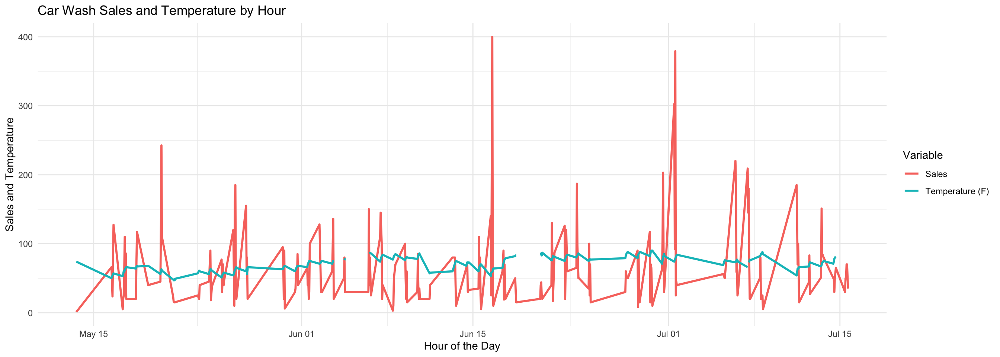
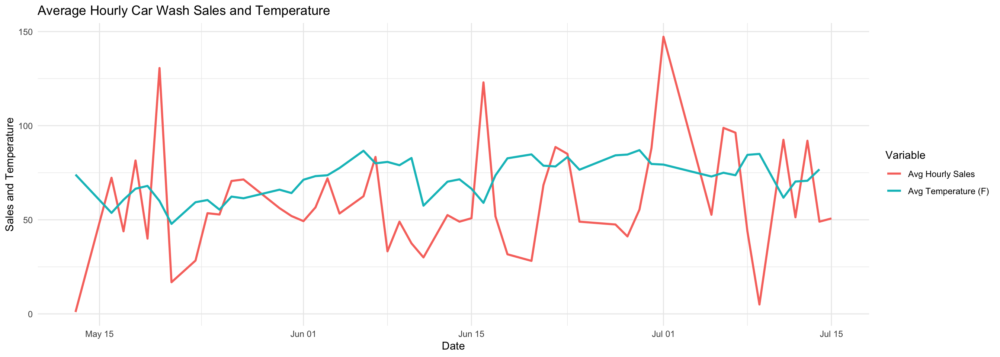
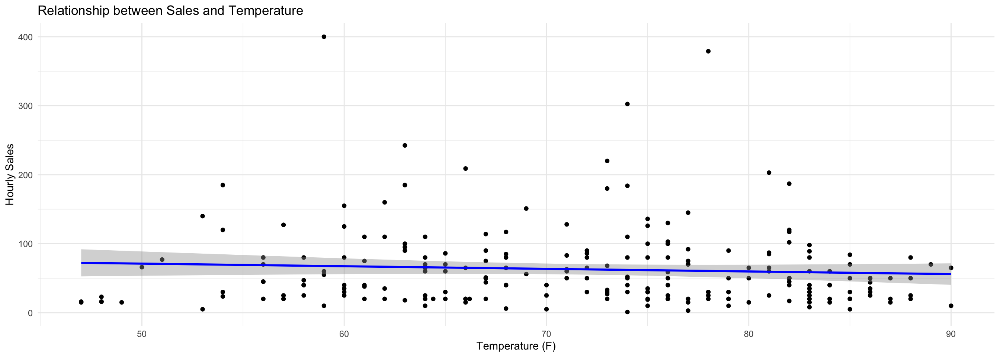

::: {.cell}

```{.r .cell-code}
pacman::p_load(directlabels, gapminder, tidyverse, ggrepel, ggthemes, rio, plotly, lubridate, riem)
```
:::

::: {.cell}

```{.r .cell-code}
carwash <- read_csv("https://byuistats.github.io/M335/data/carwash.csv")

# Convert UTC to local timez
carwash <- carwash %>%
  mutate(local_time = with_tz(ymd_hms(time), tzone = "America/Los_Angeles"))

head(carwash)
```

::: {.cell-output .cell-output-stdout}

```
# A tibble: 6 × 5
  name          type     time                amount local_time         
  <chr>         <chr>    <dttm>               <dbl> <dttm>             
1 SplashandDash Services 2016-05-13 20:27:00    1   2016-05-13 13:27:00
2 SplashandDash Services 2016-05-13 20:27:00    0   2016-05-13 13:27:00
3 SplashandDash Services 2016-05-16 19:31:00   23.6 2016-05-16 12:31:00
4 SplashandDash Services 2016-05-16 17:09:00   18.9 2016-05-16 10:09:00
5 SplashandDash Services 2016-05-16 17:47:00   23.6 2016-05-16 10:47:00
6 SplashandDash Services 2016-05-16 17:50:00   23.6 2016-05-16 10:50:00
```


:::

```{.r .cell-code}
#summary(carwash)
```
:::

::: {.cell}

```{.r .cell-code}
carwash = carwash %>%
  filter(!is.na(amount) & amount > 0)

head(carwash)
```

::: {.cell-output .cell-output-stdout}

```
# A tibble: 6 × 5
  name          type     time                amount local_time         
  <chr>         <chr>    <dttm>               <dbl> <dttm>             
1 SplashandDash Services 2016-05-13 20:27:00    1   2016-05-13 13:27:00
2 SplashandDash Services 2016-05-16 19:31:00   23.6 2016-05-16 12:31:00
3 SplashandDash Services 2016-05-16 17:09:00   18.9 2016-05-16 10:09:00
4 SplashandDash Services 2016-05-16 17:47:00   23.6 2016-05-16 10:47:00
5 SplashandDash Services 2016-05-16 17:50:00   23.6 2016-05-16 10:50:00
6 SplashandDash Services 2016-05-16 21:23:00   18.9 2016-05-16 14:23:00
```


:::
:::

::: {.cell}

```{.r .cell-code}
# Create an hourly grouping variable and aggregate sales
carwash <- carwash %>%
  mutate(hour = ceiling_date(local_time, "hour")) %>%
  group_by(hour) %>%
  summarize(hourly_amount = sum(amount, na.rm = TRUE))

head(carwash)
```

::: {.cell-output .cell-output-stdout}

```
# A tibble: 6 × 2
  hour                hourly_amount
  <dttm>                      <dbl>
1 2016-05-13 14:00:00           1  
2 2016-05-16 11:00:00          66.0
3 2016-05-16 13:00:00          23.6
4 2016-05-16 15:00:00         127. 
5 2016-05-17 09:00:00           5  
6 2016-05-17 10:00:00          20  
```


:::
:::

::: {.cell}

```{.r .cell-code}
date_start <- min(carwash$hour)
date_end <- max(carwash$hour)

date_start
```

::: {.cell-output .cell-output-stdout}

```
[1] "2016-05-13 14:00:00 PDT"
```


:::

```{.r .cell-code}
date_end
```

::: {.cell-output .cell-output-stdout}

```
[1] "2016-07-15 16:00:00 PDT"
```


:::
:::

::: {.cell}

```{.r .cell-code}
temp_data <- riem_measures(station = "RXE", date_start = "2016-05-13", date_end = "2016-07-15")

head(temp_data)
```

::: {.cell-output .cell-output-stdout}

```
# A tibble: 6 × 32
  station valid                 lon   lat  tmpf  dwpf  relh  drct  sknt  p01i
  <chr>   <dttm>              <dbl> <dbl> <dbl> <dbl> <dbl> <dbl> <dbl> <dbl>
1 RXE     2016-05-13 00:00:00 -112.  43.8    NA    NA    NA   220    14    NA
2 RXE     2016-05-13 00:05:00 -112.  43.8    NA    NA    NA   200    13    NA
3 RXE     2016-05-13 00:10:00 -112.  43.8    NA    NA    NA   200    12    NA
4 RXE     2016-05-13 00:15:00 -112.  43.8    NA    NA    NA   210    16    NA
5 RXE     2016-05-13 00:20:00 -112.  43.8    NA    NA    NA   200    14    NA
6 RXE     2016-05-13 00:25:00 -112.  43.8    NA    NA    NA   210    13    NA
# ℹ 22 more variables: alti <dbl>, mslp <dbl>, vsby <dbl>, gust <dbl>,
#   skyc1 <chr>, skyc2 <chr>, skyc3 <chr>, skyc4 <lgl>, skyl1 <dbl>,
#   skyl2 <dbl>, skyl3 <dbl>, skyl4 <lgl>, wxcodes <chr>,
#   ice_accretion_1hr <lgl>, ice_accretion_3hr <lgl>, ice_accretion_6hr <lgl>,
#   peak_wind_gust <dbl>, peak_wind_drct <dbl>, peak_wind_time <chr>,
#   feel <dbl>, metar <chr>, snowdepth <lgl>
```


:::

```{.r .cell-code}
temp_data <- temp_data %>%
  mutate(hour = ceiling_date(valid, "hour")) %>%
  select(hour, tmpf) %>% 
  filter(!is.na(tmpf))


head(temp_data)
```

::: {.cell-output .cell-output-stdout}

```
# A tibble: 6 × 2
  hour                 tmpf
  <dttm>              <dbl>
1 2016-05-13 01:00:00    68
2 2016-05-13 02:00:00    66
3 2016-05-13 03:00:00    63
4 2016-05-13 04:00:00    59
5 2016-05-13 05:00:00    58
6 2016-05-13 06:00:00    55
```


:::
:::

::: {.cell}

```{.r .cell-code}
combined_data <- left_join(carwash, temp_data, by = "hour")

head(combined_data)
```

::: {.cell-output .cell-output-stdout}

```
# A tibble: 6 × 3
  hour                hourly_amount  tmpf
  <dttm>                      <dbl> <dbl>
1 2016-05-13 14:00:00           1      74
2 2016-05-16 11:00:00          66.0    50
3 2016-05-16 13:00:00          23.6    54
4 2016-05-16 15:00:00         127.     57
5 2016-05-17 09:00:00           5      53
6 2016-05-17 10:00:00          20      56
```


:::
:::

::: {.cell}

```{.r .cell-code}
# Plot hourly sales and temperature over time
ggplot(combined_data, aes(x = hour)) +
  geom_line(aes(y = hourly_amount, color = "Sales"), size = 1) +
  geom_line(aes(y = tmpf, color = "Temperature (F)"), size = 1) +
  labs(title = "Car Wash Sales and Temperature by Hour",
       x = "Hour of the Day",
       y = "Sales and Temperature",
       color = "Variable") +
  theme_minimal()
```

::: {.cell-output-display}
{width=1344}
:::
:::

::: {.cell}

```{.r .cell-code}
hourly_averages <- combined_data %>%
  mutate(date = as.Date(hour)) %>%  # Extract just the date
  group_by(date) %>%
  summarize(
    avg_amount = mean(hourly_amount, na.rm = TRUE),
    avg_temp = mean(tmpf, na.rm = TRUE)
  )

ggplot(hourly_averages, aes(x = date)) +
  geom_line(aes(y = avg_amount, color = "Avg Hourly Sales"), size = 1) +
  geom_line(aes(y = avg_temp, color = "Avg Temperature (F)"), size = 1) +
  labs(title = "Average Hourly Car Wash Sales and Temperature",
       x = "Date",
       y = "Sales and Temperature",
       color = "Variable") +
  theme_minimal()
```

::: {.cell-output-display}
{width=1344}
:::
:::

::: {.cell}

```{.r .cell-code}
# Scatter plot of sales vs. temperature
ggplot(combined_data, aes(x = tmpf, y = hourly_amount)) +
  geom_point() +
  geom_smooth(method = "lm", color = "blue") +
  labs(title = "Relationship between Sales and Temperature",
       x = "Temperature (F)",
       y = "Hourly Sales") +
  theme_minimal()
```

::: {.cell-output-display}
{width=1344}
:::
:::


Based on the data I'm sure there are patterns, but they are not distinct enough to really be able to quickly see them in a chart. Especially, with the outliers in that data. To better find the patterns a statistical test might be needed, or just more data. There dose seem to be a mild rise in sales when the temperature rises, but there isn’t a very clear pattern.

