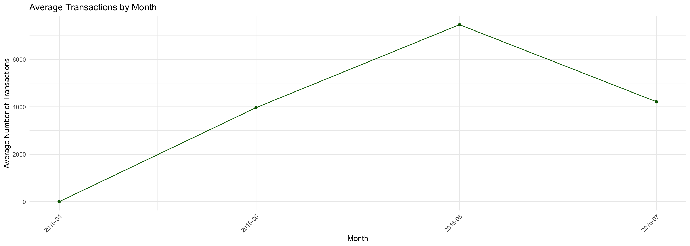

::: {.cell}

```{.r .cell-code}
pacman::p_load(directlabels, gapminder, tidyverse, ggrepel, ggthemes, rio, plotly, lubridate, scales, patchwork)
```
:::

::: {.cell}

```{.r .cell-code}
sales_data <- read_csv("https://byuistats.github.io/M335/data/sales.csv")

sales_data <- sales_data %>%
  mutate(Time = ymd_hms(Time, tz = "UTC") %>% 
           with_tz("America/Denver"))
```
:::

::: {.cell}

```{.r .cell-code}
summary(sales_data)
```

::: {.cell-output .cell-output-stdout}

```
     Name               Type                Time                       
 Length:15656       Length:15656       Min.   :2016-04-20 13:01:00.00  
 Class :character   Class :character   1st Qu.:2016-05-31 13:40:45.00  
 Mode  :character   Mode  :character   Median :2016-06-15 11:14:00.00  
                                       Mean   :2016-06-15 23:49:38.56  
                                       3rd Qu.:2016-07-01 18:28:30.00  
                                       Max.   :2016-07-20 09:53:00.00  
                                       NA's   :8                       
     Amount        
 Min.   :-194.500  
 1st Qu.:   2.500  
 Median :   3.000  
 Mean   :   5.294  
 3rd Qu.:   4.500  
 Max.   :1026.000  
                   
```


:::

```{.r .cell-code}
sales_data <- sales_data %>%
  drop_na()  

sales_data$Time <- as.POSIXct(sales_data$Time, tz = "UTC")
sales_data <- sales_data %>%
  mutate(day = floor_date(Time, "day"),
         week = floor_date(Time, "week"),
         month = floor_date(Time, "month"))
head(sales_data)
```

::: {.cell-output .cell-output-stdout}

```
# A tibble: 6 × 7
  Name  Type  Time                Amount day                 week               
  <chr> <chr> <dttm>               <dbl> <dttm>              <dttm>             
1 Taco… Food… 2016-05-16 19:01:00    3   2016-05-16 00:00:00 2016-05-15 00:00:00
2 Taco… Food… 2016-05-16 19:01:00    1.5 2016-05-16 00:00:00 2016-05-15 00:00:00
3 Taco… Food… 2016-05-16 19:04:00    3   2016-05-16 00:00:00 2016-05-15 00:00:00
4 Taco… Food… 2016-05-16 19:04:00    3   2016-05-16 00:00:00 2016-05-15 00:00:00
5 Taco… Food… 2016-05-16 19:04:00    1.5 2016-05-16 00:00:00 2016-05-15 00:00:00
6 Taco… Food… 2016-05-16 19:04:00    1   2016-05-16 00:00:00 2016-05-15 00:00:00
# ℹ 1 more variable: month <dttm>
```


:::
:::

::: {.cell}

```{.r .cell-code}
daily_revenue <- sales_data %>%
  group_by(Name, day) %>%
  summarise(gross_revenue = sum(Amount), .groups = 'drop')

weekly_revenue <- sales_data %>%
  group_by(Name, week) %>%
  summarize(gross_revenue = sum(Amount), .groups = 'drop')

monthly_revenue <- sales_data %>%
  group_by(Name, month) %>%
  summarize(gross_revenue = sum(Amount), .groups = 'drop')

head(daily_revenue)
```

::: {.cell-output .cell-output-stdout}

```
# A tibble: 6 × 3
  Name    day                 gross_revenue
  <chr>   <dttm>                      <dbl>
1 Frozone 2016-05-16 00:00:00          40  
2 Frozone 2016-05-17 00:00:00          92  
3 Frozone 2016-05-18 00:00:00         128  
4 Frozone 2016-05-19 00:00:00          49.5
5 Frozone 2016-05-20 00:00:00         106  
6 Frozone 2016-05-21 00:00:00          40  
```


:::

```{.r .cell-code}
head(weekly_revenue)
```

::: {.cell-output .cell-output-stdout}

```
# A tibble: 6 × 3
  Name    week                gross_revenue
  <chr>   <dttm>                      <dbl>
1 Frozone 2016-05-15 00:00:00         456. 
2 Frozone 2016-05-22 00:00:00         -27.0
3 Frozone 2016-05-29 00:00:00         -24.7
4 Frozone 2016-06-05 00:00:00         999. 
5 Frozone 2016-06-12 00:00:00         776. 
6 Frozone 2016-06-19 00:00:00         673. 
```


:::

```{.r .cell-code}
head(monthly_revenue)
```

::: {.cell-output .cell-output-stdout}

```
# A tibble: 6 × 3
  Name       month               gross_revenue
  <chr>      <dttm>                      <dbl>
1 Frozone    2016-05-01 00:00:00         415. 
2 Frozone    2016-06-01 00:00:00        2893. 
3 Frozone    2016-07-01 00:00:00        2415. 
4 HotDiggity 2016-04-01 00:00:00         -87.7
5 HotDiggity 2016-05-01 00:00:00        5951. 
6 HotDiggity 2016-06-01 00:00:00        9327. 
```


:::
:::

::: {.cell}

```{.r .cell-code}
p1 <- ggplot(daily_revenue, aes(x = day, y = gross_revenue, color = Name)) +
  geom_line() + labs(title = "Daily Gross Revenue", x = "Date", y = "Gross Revenue") +
  scale_y_continuous(labels = dollar_format())

p2 <- ggplot(weekly_revenue, aes(x = week, y = gross_revenue, color = Name)) +
  geom_line() + labs(title = "Weekly Gross Revenue", x = "Week", y = "Gross Revenue") +
  scale_y_continuous(labels = dollar_format())

p3 <- ggplot(monthly_revenue, aes(x = month, y = gross_revenue, color = Name)) +
  geom_line() + labs(title = "Monthly Gross Revenue", x = "Month", y = "Gross Revenue") +
  scale_y_continuous(labels = dollar_format())

p1 + p2 + p3
```

::: {.cell-output-display}
{width=1344}
:::
:::

::: {.cell}

```{.r .cell-code}
daily_traffic <- sales_data %>%
  group_by(Name, day) %>%
  summarize(transactions = n())

weekly_traffic <- sales_data %>%
  group_by(Name, week) %>%
  summarize(transactions = n())

monthly_traffic <- sales_data %>%
  group_by(Name, month) %>%
  summarize(transactions = n())

p4 <- ggplot(daily_traffic, aes(x = day, y = transactions, color = Name)) +
  geom_line() + labs(title = "Daily Customer Traffic", x = "Date", y = "Transactions")

p5 <- ggplot(weekly_traffic, aes(x = week, y = transactions, color = Name)) +
  geom_line() + labs(title = "Weekly Customer Traffic", x = "Week", y = "Transactions")

p6 <- ggplot(monthly_traffic, aes(x = month, y = transactions, color = Name)) +
  geom_line() + labs(title = "Monthly Customer Traffic", x = "Month", y = "Transactions")

p4 + p5 + p6
```

::: {.cell-output-display}
{width=1344}
:::
:::

::: {.cell}

```{.r .cell-code}
sales_data <- sales_data %>%
  mutate(Time = ymd_hms(Time),  # Ensure Time is in the correct date-time format
         hour = hour(Time),      # Extract hour from the correct column
         day = floor_date(Time, "day"),
         week = floor_date(Time, "week"),
         month = floor_date(Time, "month"))

hourly_traffic <- sales_data %>%
  group_by(Name, hour) %>%
  summarize(transactions = n())

# Plot
ggplot(hourly_traffic, aes(x = hour, y = transactions, fill = Name)) +
  geom_bar(stat = "identity", position = "dodge") +
  labs(title = "Hours of Operation by Company", x = "Hour of Day", y = "Number of Transactions") +
  theme_minimal()
```

::: {.cell-output-display}
{width=1344}
:::
:::

::: {.cell}

```{.r .cell-code}
average_transactions_by_hour <- sales_data %>%
  group_by(hour) %>%
  summarise(average_transactions = n(), .groups = 'drop')  

ggplot(average_transactions_by_hour, aes(x = hour, y = average_transactions)) +
  geom_line(color = "blue") +              
  geom_point(color = "blue") +              
  labs(title = "Average Transactions by Hour",
       x = "Hour of the Day",
       y = "Average Number of Transactions") +
  theme_minimal() +                        
  scale_x_continuous(breaks = 0:23) +     
  theme(axis.text.x = element_text(angle = 45, hjust = 1))  
```

::: {.cell-output-display}
{width=1344}
:::
:::

::: {.cell}

```{.r .cell-code}
average_transactions_by_month <- sales_data %>%
  group_by(month) %>%
  summarise(average_transactions = n(), .groups = 'drop')  

average_transactions_by_month <- average_transactions_by_month %>%
  mutate(month = as.Date(paste(year(month), month(month), "01", sep = "-")))

ggplot(average_transactions_by_month, aes(x = month, y = average_transactions)) +
  geom_line(color = "darkgreen") +              
  geom_point(color = "darkgreen") +              
  labs(title = "Average Transactions by Month",
       x = "Month",
       y = "Average Number of Transactions") +
  theme_minimal() +                             
  scale_x_date(date_labels = "%Y-%m", date_breaks = "1 month") +  
  theme(axis.text.x = element_text(angle = 45, hjust = 1))  
```

::: {.cell-output-display}
{width=1344}
:::
:::
