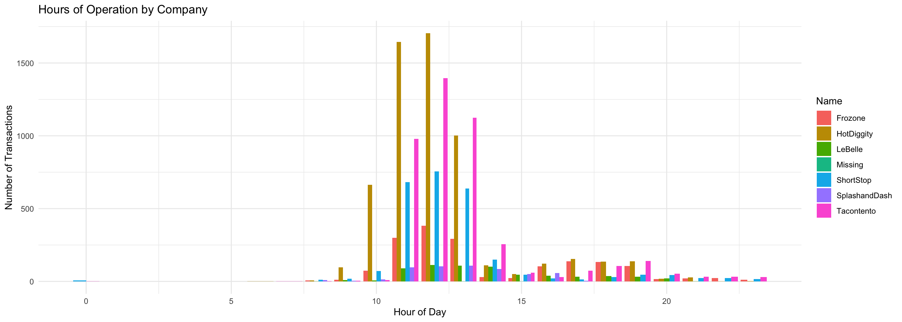
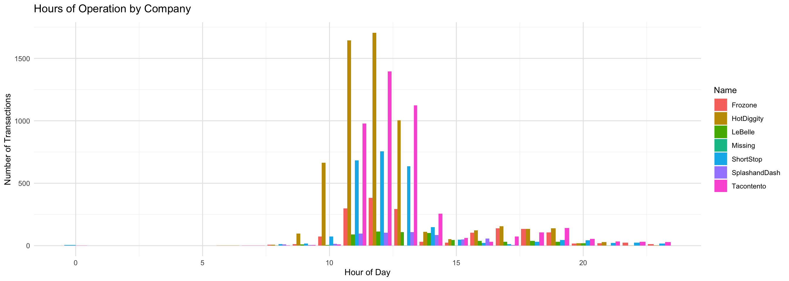

::: {.cell}

```{.r .cell-code}
pacman::p_load(directlabels, gapminder, tidyverse, ggrepel, ggthemes, rio, plotly, lubridate, scales, patchwork)
```
:::

::: {.cell}

```{.r .cell-code}
sales_data <- read_csv("https://byuistats.github.io/M335/data/sales.csv")

sales_data <- sales_data %>%
  mutate(Time = ymd_hms(Time, tz = "UTC") %>% 
           with_tz("America/Denver")) %>% 
  mutate(day = floor_date(Time, "day"),
         hour = hour(Time),
         week = floor_date(Time, "week"),
         month = floor_date(Time, "month"))
 
#head(sales_data)

hourly_traffic <- sales_data %>%
  group_by(Name, hour) %>%
  summarize(transactions = n())

#head(hourly_traffic)
```
:::


# Original Chart

::: {.cell}

```{.r .cell-code}
ggplot(hourly_traffic, aes(x = hour, y = transactions, fill = Name)) +
  geom_bar(stat = "identity", position = "dodge") +
  labs(title = "Hours of Operation by Company", x = "Hour of Day", y = "Number of Transactions") +
  theme_minimal()
```

::: {.cell-output-display}
{width=1344}
:::
:::


# My AI imput:

Here is the ddata I'm workinng with: head(sales_data)
A tibble: 6 × 8
  Name       Type           Time                Amount day                 week                month                hour
  <chr>      <chr>          <dttm>               <dbl> <dttm>              <dttm>              <dttm>              <int>
1 Tacontento Food(prepared) 2016-05-16 01:01:00    3   2016-05-16 00:00:00 2016-05-15 00:00:00 2016-05-01 00:00:00    13
2 Tacontento Food(prepared) 2016-05-16 01:01:00    1.5 2016-05-16 00:00:00 2016-05-15 00:00:00 2016-05-01 00:00:00    13
3 Tacontento Food(prepared) 2016-05-16 01:04:00    3   2016-05-16 00:00:00 2016-05-15 00:00:00 2016-05-01 00:00:00    13
4 Tacontento Food(prepared) 2016-05-16 01:04:00    3   2016-05-16 00:00:00 2016-05-15 00:00:00 2016-05-01 00:00:00    13
5 Tacontento Food(prepared) 2016-05-16 01:04:00    1.5 2016-05-16 00:00:00 2016-05-15 00:00:00 2016-05-01 00:00:00    13
6 Tacontento Food(prepared) 2016-05-16 01:04:00    1   2016-05-16 00:00:00 2016-05-15 00:00:00 2016-05-01 00:00:00    13

head(hourly_traffic)
A tibble: 6 × 3
Groups:   Name [1]
  Name     hour transactions
  <chr>   <int>        <int>
1 Frozone     8            7
2 Frozone     9           11
3 Frozone    10           73
4 Frozone    11          299
5 Frozone    12          382
6 Frozone    13          293

pacman::p_load(directlabels, gapminder, tidyverse, ggrepel, ggthemes, rio, plotly, lubridate, scales, patchwork)

sales_data <- read_csv("https://byuistats.github.io/M335/data/sales.csv")

sales_data <- sales_data %>%
  mutate(Time = ymd_hms(Time, tz = "UTC") %>% 
           with_tz("America/Denver")) %>% 
  mutate(day = floor_date(Time, "day"),
         week = floor_date(Time, "week"),
         month = floor_date(Time, "month"))

head(sales_data)

hourly_traffic <- sales_data %>%
  group_by(Name, hour) %>%
  summarize(transactions = n())

head(hourly_traffic)


I also gave the AI a picture of the chart.


# AI chart

::: {.cell}

```{.r .cell-code}
ggplot(hourly_traffic, aes(x = hour, y = transactions, fill = Name)) +
  geom_col(position = "dodge") +
  scale_x_continuous(breaks = seq(0, 24, 5)) +
  scale_y_continuous(breaks = seq(0, 2000, 500)) +
  labs(
    title = "Hours of Operation by Company",
    x = "Hour of Day",
    y = "Number of Transactions",
    fill = "Name"
  ) +
  theme_minimal() +
  theme(
    panel.grid.minor = element_line(color = "gray95"),
    panel.grid.major = element_line(color = "gray90"),
    plot.title = element_text(size = 14, margin = margin(b = 10)),
    axis.text = element_text(size = 9),
    legend.position = "right"
  )
```

::: {.cell-output-display}
{width=1344}
:::
:::
