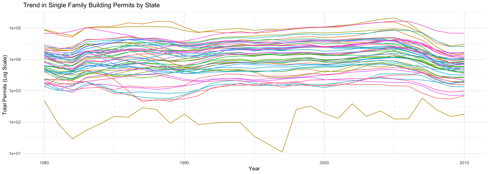
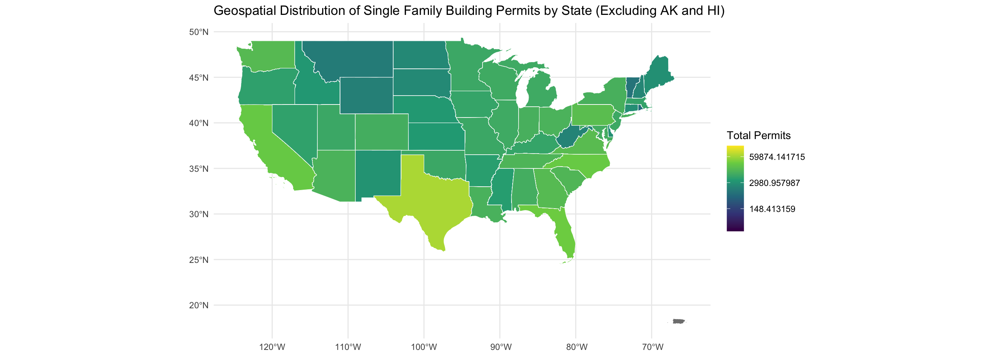
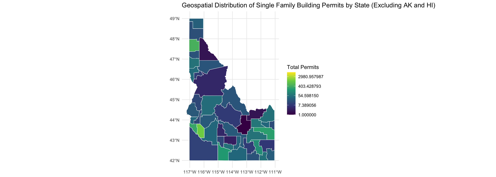

::: {.cell}

```{.r .cell-code}
library(USAboundaries)
library(buildings)
library(dplyr)
library(ggplot2)
library(sf)
library(buildings)
```
:::

::: {.cell}

```{.r .cell-code}
states_data <- us_states()  
idaho_counties <- us_counties(state = "Idaho")  
permit_data <- buildings::permits
```
:::

::: {.cell}

```{.r .cell-code}
permit_data = permit_data %>%
  rename(stusps = StateAbbr)

#permit_data
```
:::

::: {.cell}

```{.r .cell-code}
permit_data = permit_data %>%
  rename(namelsad = countyname)

#permit_data
```
:::

::: {.cell}

```{.r .cell-code}
state_permits <- permit_data %>%
  filter(variable == "Single Family") %>%
  group_by(state, stusps, year) %>%
  summarize(total_permits = sum(value, na.rm = TRUE))
```
:::

::: {.cell}

```{.r .cell-code}
state_permits_sf <- left_join(states_data, state_permits, by = "stusps")

names(state_permits_sf)
```

::: {.cell-output .cell-output-stdout}

```
 [1] "statefp"           "statens"           "affgeoid"         
 [4] "geoid"             "stusps"            "name"             
 [7] "lsad"              "aland"             "awater"           
[10] "state_name"        "state_abbr"        "jurisdiction_type"
[13] "state"             "year"              "total_permits"    
[16] "geometry"         
```


:::
:::

::: {.cell}

```{.r .cell-code}
county_permits <- permit_data %>%
  filter(variable == "Single Family" & state == 16) %>%  
  group_by(namelsad, county, year) %>%
  summarize(total_permits = sum(value, na.rm = TRUE))
```
:::

::: {.cell}

```{.r .cell-code}
idaho_counties <- idaho_counties %>%
  select(-`state_name`)

county_permits_sf <- left_join(idaho_counties, county_permits, by = "namelsad") # countyname, namelsad

names(county_permits_sf)
```

::: {.cell-output .cell-output-stdout}

```
 [1] "statefp"           "countyfp"          "countyns"         
 [4] "affgeoid"          "geoid"             "name"             
 [7] "namelsad"          "stusps"            "lsad"             
[10] "aland"             "awater"            "state_abbr"       
[13] "jurisdiction_type" "county"            "year"             
[16] "total_permits"     "geometry"         
```


:::
:::

::: {.cell}

```{.r .cell-code}
names(county_permits_sf)
```

::: {.cell-output .cell-output-stdout}

```
 [1] "statefp"           "countyfp"          "countyns"         
 [4] "affgeoid"          "geoid"             "name"             
 [7] "namelsad"          "stusps"            "lsad"             
[10] "aland"             "awater"            "state_abbr"       
[13] "jurisdiction_type" "county"            "year"             
[16] "total_permits"     "geometry"         
```


:::

```{.r .cell-code}
names(state_permits_sf)
```

::: {.cell-output .cell-output-stdout}

```
 [1] "statefp"           "statens"           "affgeoid"         
 [4] "geoid"             "stusps"            "name"             
 [7] "lsad"              "aland"             "awater"           
[10] "state_name"        "state_abbr"        "jurisdiction_type"
[13] "state"             "year"              "total_permits"    
[16] "geometry"         
```


:::
:::

::: {.cell}

```{.r .cell-code}
state_trend <- state_permits_sf %>%
  group_by(state_abbr, year) %>%
  summarize(total_permits = sum(total_permits, na.rm = TRUE))

# Plotting the line chart
ggplot(state_trend, aes(x = year, y = total_permits, color = state_abbr)) +
  geom_line() +
  scale_y_log10() +  # Apply log scale for y-axis to handle disparities
  theme_minimal() +
  labs(title = "Trend in Single Family Building Permits by State",
       x = "Year",
       y = "Total Permits (Log Scale)",
       color = "State") +
  theme(legend.position = "none")
```

::: {.cell-output-display}
{width=1344}
:::
:::

::: {.cell}

```{.r .cell-code}
state_permits_sf_filtered <- state_permits_sf %>%
  filter(!state_abbr %in% c("AK", "HI"))

ggplot(state_permits_sf_filtered) +
  geom_sf(aes(fill = total_permits), color = "white") +
  scale_fill_viridis_c(trans = "log", name = "Total Permits") +  
  theme_minimal() +
  labs(title = "Geospatial Distribution of Single Family Building Permits by State (Excluding AK and HI)")
```

::: {.cell-output-display}
{width=1344}
:::
:::

::: {.cell}

```{.r .cell-code}
ggplot(county_permits_sf) +
  geom_sf(aes(fill = total_permits), color = "white") +
  scale_fill_viridis_c(trans = "log", name = "Total Permits") +  
  theme_minimal() +
  labs(title = "Geospatial Distribution of Single Family Building Permits by State (Excluding AK and HI)")
```

::: {.cell-output-display}
{width=1344}
:::
:::
