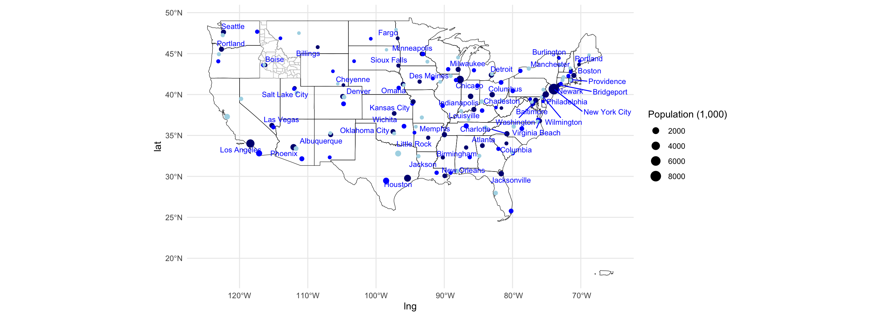

::: {.cell}

```{.r .cell-code}
pacman::p_load(directlabels, gapminder, tidyverse, ggrepel, ggthemes, rio, plotly, lubridate, scales, patchwork, USAboundaries, sf)
```
:::

::: {.cell}

```{.r .cell-code}
states <- us_states() %>%
  filter(!name %in% c("Hawaii", "Alaska"))

idaho_counties <- us_counties(states = "Idaho")
```
:::

::: {.cell}

```{.r .cell-code}
cities <- us_cities() %>%
  filter(!state_name %in% c("Hawaii", "Alaska")) %>%
  group_by(state_name) %>%
  slice_max(population, n = 3) %>%
  mutate(rank = row_number()) %>%
  ungroup()
```
:::

::: {.cell}

```{.r .cell-code}
cities <- cities %>%
  mutate(lng = st_coordinates(geometry)[, 1],
         lat = st_coordinates(geometry)[, 2])

largest_cities <- cities %>% filter(rank == 1)

ggplot() +
  geom_sf(data = states, fill = NA, color = "black") +
  geom_sf(data = idaho_counties, fill = NA, color = "grey") +
  geom_point(data = cities, aes(x = lng, y = lat, size = population / 1000, color = as.factor(rank))) +
  scale_size_continuous(range = c(1, 5), name = "Population (1,000)") +
  scale_color_manual(values = c("navy", "blue", "lightblue"), guide = "none") +
  theme_minimal() +
  geom_text_repel(data = largest_cities, aes(x = lng, y = lat, label = city), 
                  size = 3, box.padding = 0.2, segment.color = "blue", color = "blue")
```

::: {.cell-output-display}
{width=1344}
:::
:::
