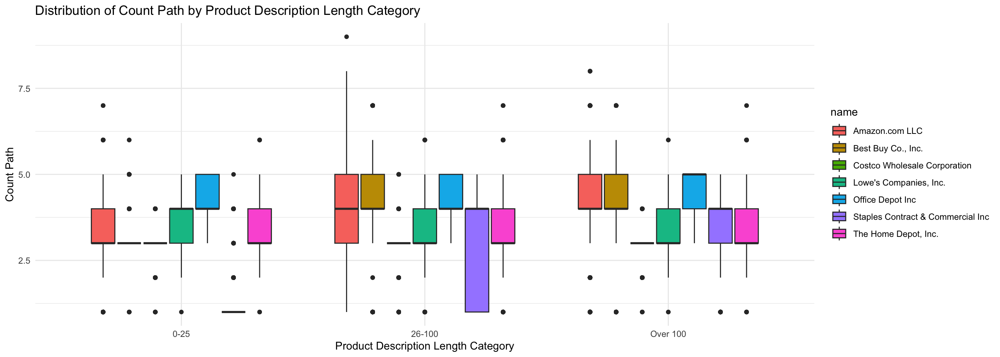
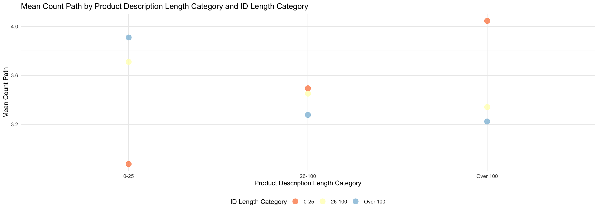
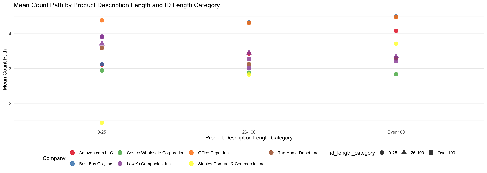

# Product Description Analysis: Exploring Count Path by Company

### Background

In this analysis, I am using a dataset that contains product information, including `product_description`, `unique_identifier`, and the associated `count_path` for various companies. The primary goal is to investigate how the `count_path` varies across different companies while considering the character lengths of `product_description` and `unique_identifier`. This study will provide insights into whether the means of `count_path` differ based on the defined categories of character counts, thus offering a better understanding of product categorization.

### Research Question and Hypothesis

**Research Question:**\
Does the mean `count_path` vary based on the character count categories of `product_description` and `unique_identifier`, grouped by company?

**Hypothesis:**

-   **Null Hypothesis (H₀):** There is no difference in `count_path` across the defined character count categories for `product_description` and `unique_identifier` among companies.\
    Mathematically, this can be expressed as: μcategory1 = μcategory2 = μcategory3

-   **Alternative Hypothesis (H₁):** At least one `count_path` differs significantly across the character count categories.\
    This implies that: μcategory1 ≠ μcategory2 or μcategory1 ≠ μcategory3 or μcategory2 ≠μcategory3

**Significance Level:** 0.05

### Data Preparation

To conduct this analysis, I first cleaned the data to handle any missing values and categorized the continuous variables for character counts. I defined three categories for both `product_description` and `unique_identifier` based on their character lengths:

-   0-25 characters

-   26-100 characters

-   Over 100 characters

After categorizing, I ensured there were no missing values in the necessary columns to maintain the integrity of the analysis.

### Exploratory Analysis

Before conducting the statistical tests, I performed an exploratory analysis to visualize potential differences in `count_path` across the defined categories. This included summary statistics to get a sense of the distribution of `count_path` based on the categories.

#### Summary of Count Path by Company and Character Count Categories:


::: {.cell}

```{.r .cell-code}
pacman::p_load(car, tidyverse, pander, dplyr, tidyr)
```
:::

::: {.cell}

```{.r .cell-code}
data <- read_csv("product_description_ds.csv") 

data <- data %>%
  mutate(count_path = str_count(category_path, ">") + 1) 
#head(data)
```
:::

::: {.cell}

```{.r .cell-code}
library(dplyr)

# Assuming 'data' is your dataframe
data <- data %>%
  mutate(
    desc_length_category = case_when(
      nchar(product_description) <= 25 ~ '0-25',
      nchar(product_description) <= 100 ~ '26-100',
      TRUE ~ 'Over 100'
    ),
    id_length_category = case_when(
      nchar(unique_identifier) <= 25 ~ '0-25',
      nchar(unique_identifier) <= 100 ~ '26-100',
      TRUE ~ 'Over 100'
    )
  )

# Check for NA values
data <- na.omit(data)  # Remove rows with NA values

# Summary statistics by category and company
summary_stats <- data %>%
  group_by(name, desc_length_category, id_length_category) %>%
  summarise(
    min = min(count_path, na.rm = TRUE),
    Q1 = quantile(count_path, 0.25, na.rm = TRUE),
    median = median(count_path, na.rm = TRUE),
    Q3 = quantile(count_path, 0.75, na.rm = TRUE),
    max = max(count_path, na.rm = TRUE),
    mean = mean(count_path, na.rm = TRUE),
    sd = sd(count_path, na.rm = TRUE),
    n = n()
  )
#print(summary_stats)
```
:::


Visualization

Visualization 1: Distribution of Count Path by Character Count Categories


::: {.cell}

```{.r .cell-code}
library(ggplot2)

# Example plot
ggplot(data, aes(x = desc_length_category, y = count_path, fill = name)) +
  geom_boxplot() +
  labs(title = "Distribution of Count Path by Product Description Length Category",
       x = "Product Description Length Category",
       y = "Count Path") +
  theme_minimal()
```

::: {.cell-output-display}
{width=1344}
:::
:::

::: {.cell}

```{.r .cell-code}
# Load necessary libraries
library(dplyr)
library(ggplot2)

# Summarize the data to calculate the mean count_path for each combination
summary_data <- data %>%
  group_by(desc_length_category, id_length_category) %>%
  summarise(mean_count_path = mean(count_path, na.rm = TRUE), .groups = 'drop')

# Create a summarized scatter plot with means
ggplot(summary_data, aes(x = desc_length_category, y = mean_count_path, color = id_length_category)) +
  geom_point(size = 4, alpha = 0.8) +  # Use points to show means
  scale_color_brewer(palette = "RdYlBu", name = "ID Length Category") +  # Choose a color palette
  labs(title = "Mean Count Path by Product Description Length Category and ID Length Category",
       x = "Product Description Length Category",
       y = "Mean Count Path") +
  theme_minimal() +
  theme(legend.position = "bottom")  # Position the legend at the bottom
```

::: {.cell-output-display}
{width=1344}
:::
:::

::: {.cell}

```{.r .cell-code}
# Load necessary libraries
library(dplyr)
library(ggplot2)

# Summarize the data to calculate the mean count_path for each combination, including company
summary_data <- data %>%
  group_by(desc_length_category, id_length_category, name) %>%
  summarise(mean_count_path = mean(count_path, na.rm = TRUE), .groups = 'drop')

# Create a summarized scatter plot with means, color for company, and shape for ID length
ggplot(summary_data, aes(x = desc_length_category, y = mean_count_path, color = name, shape = id_length_category)) +
  geom_point(size = 4, alpha = 0.8) +  # Use points to show means
  scale_color_brewer(palette = "Set1", name = "Company") +  # Choose a color palette for companies
  labs(title = "Mean Count Path by Product Description Length and ID Length Category",
       x = "Product Description Length Category",
       y = "Mean Count Path") +
  theme_minimal() +
  theme(legend.position = "bottom")  # Position the legend at the bottom
```

::: {.cell-output-display}
{width=1344}
:::
:::


Running the Kruskal-Wallis Test

The Kruskal-Wallis test is used to compare the means of count_path across the defined character count categories.


::: {.cell}

```{.r .cell-code}
kruskal_desc_result <- kruskal.test(count_path ~ desc_length_category, data = data)

#print(kruskal_desc_result)
```
:::


### Results

The Kruskal-Wallis test yielded the following outcomes:

-   **Test Statistic:** 22453

-   **Degrees of Freedom:** 2

-   **P-Value:** \< 2.2e-16

### Interpretation and Analysis

Given the p-value from the Kruskal-Wallis test:

-   Since the p-value is significantly less than 0.05, we reject the null hypothesis. This indicates that there are substantial differences in `count_path` among the character count categories for the `product_description` and `unique_identifier`, grouped by `company`.

### Conclusion

In this analysis, I investigated how `count_path` varies across character count categories in the `product_description` and `unique_identifier`, organized by `company`. The results of the Kruskal-Wallis test reveal a significant difference in `count_path` among the various character length categories.

This study highlights the effectiveness of non-parametric tests, such as the Kruskal-Wallis test, in identifying differences among multiple groups without relying on the assumption of normal distribution. Future research could explore additional variables or employ a larger sample size to uncover more nuanced relationships.

<br><br><br>
